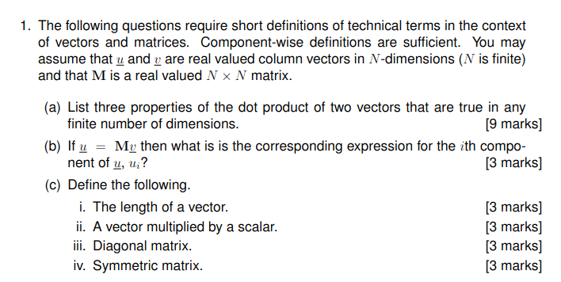

# MDDP paper 24

# 1

# Answers

## 1(a)

$$
Three properties of the dot product \(\underline{u} \cdot \underline{v}\) in any finite dimensions are:
1. **Commutative**: \(\underline{u} \cdot \underline{v} = \underline{v} \cdot \underline{u}\).
2. **Distributive over addition**: \(\underline{u} \cdot (\underline{v} + \underline{w}) = \underline{u} \cdot \underline{v} + \underline{u} \cdot \underline{w}\).
3. **Compatible with scalar multiplication**: \((c\underline{u}) \cdot \underline{v} = c(\underline{u} \cdot \underline{v})\), where \(c\) is a scalar.
$$

---

## 1(b)

The \(i\)th component of \(\underline{u}\) is:
\[
u_i = \sum_{j=1}^N M_{ij} v_j
\]
where \(M_{ij}\) is the element in the \(i\)th row and \(j\)th column of matrix \(M\).

---

# 

## 1(c)

### i. Length of a vector

The length (or Euclidean norm) of a vector \(\underline{v}\) is:
\[
\|\underline{v}\| = \sqrt{v_1^2 + v_2^2 + \dots + v_N^2} = \sqrt{\sum_{i=1}^N v_i^2}.
\]

### ii. Vector multiplied by a scalar

If \(\underline{v}\) is multiplied by a scalar \(c\), the resulting vector \(c\underline{v}\) has components:
\[
(c\underline{v})_i = c \cdot v_i \quad \text{for all } i.
\]

### iii. Diagonal matrix

A diagonal matrix \(M\) satisfies:
\[
M_{ij} =
\begin{cases}
\text{any real number} & \text{if } i = j, \\
0 & \text{if } i \neq j.
\end{cases}
\]

### iv. Symmetric matrix

A matrix \(M\) is symmetric if:
\[
M_{ij} = M_{ji} \quad \text{for all } i, j.
\]
