# Infosec 23 paper

## Question 1 (25 marks)

### 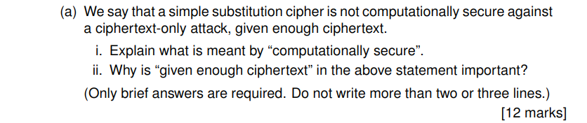

### i Computationally Secure refers to a cryptosystem being secure agaisnt an attack using a feasible amount of resources
### ii. Given enough ciphertext is important as if an attacker has too much ciphertext they could preform statistical analysis on it to work out some plaintext. with the likes of bigrams and trigrams such as "the,ing,in,an"making it easier to determine plaintext

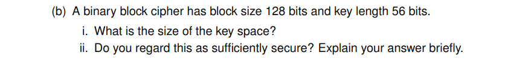

### i. 2 to power of 56
### ii. No this is not secure enough. It could be broken with a brute force attack in a resonable amount of time.

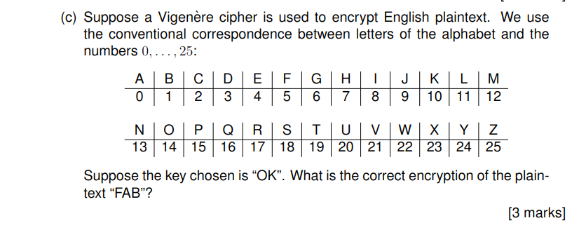

### TKP

## Question 2

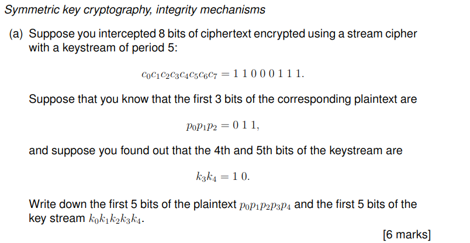

### a)     First 5 plaintext bits: =0 1 1 1 0. First 5 keystream bits: 1 0 1 1 0.

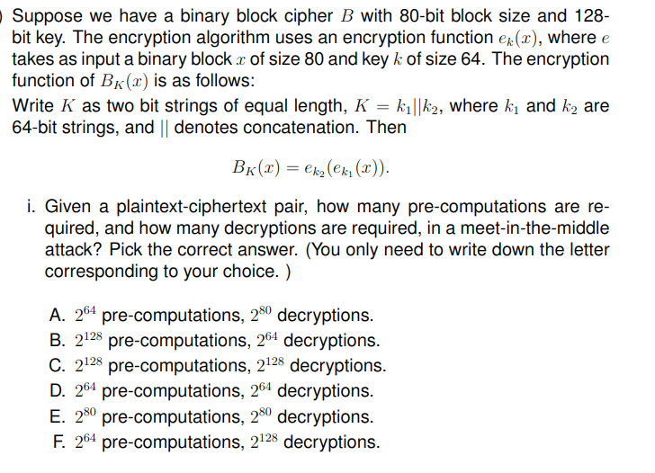
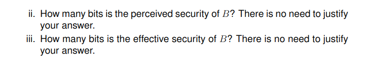

### i. D

### ii. 128

### iii. 64

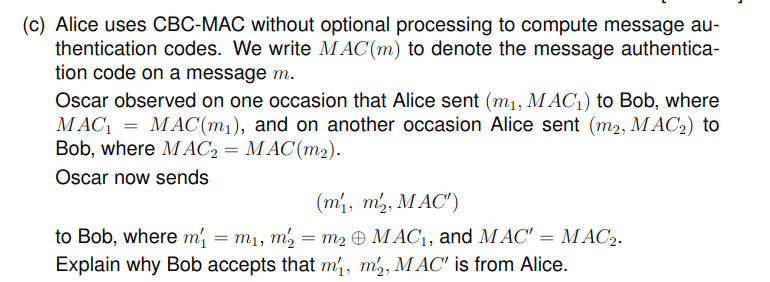

### ​The forged m2′​=m2​⊕MAC1​ cancels out the intermediate MAC1​ during verification,making MAC′=MAC2​ valid for (m1′​,m2′​). This exploits CBC-MAC’s structure without optional processing.​

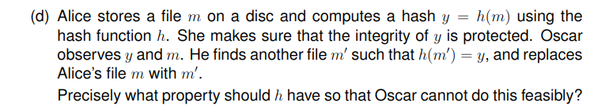

###  second preimage resistant

## Question 3

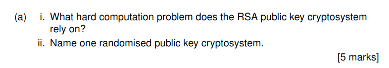

### i.  Integer Factorization ProblemInteger Factorization Problem
### ii. ElGamal Encryption

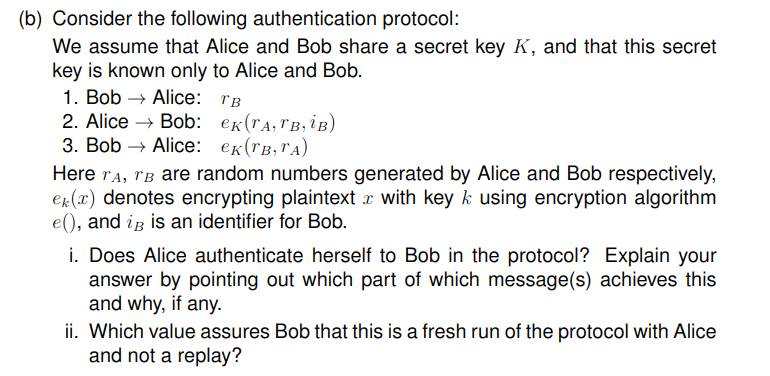

### i. Alice to Bob: eK​(rA​,rB​,iB​)

### ii. rA

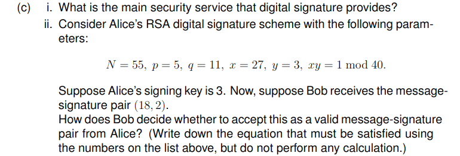

### i. Non-repudiation 

### ii. 18≡23(mod55)18≡23(mod55)

## Question 4
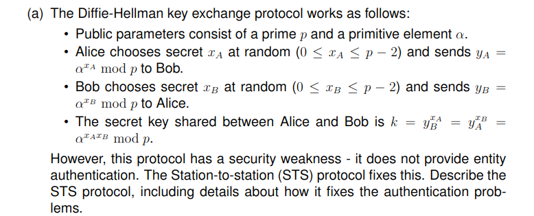

### The STS protocol fixes DH’s authentication problems by:

- Adding digital signatures on exchanged DH values (yA,yByA​,yB​).

- Requiring certificates to verify public keys.

- Binding the DH values to the session via signatures, preventing MITM and replay attacks.

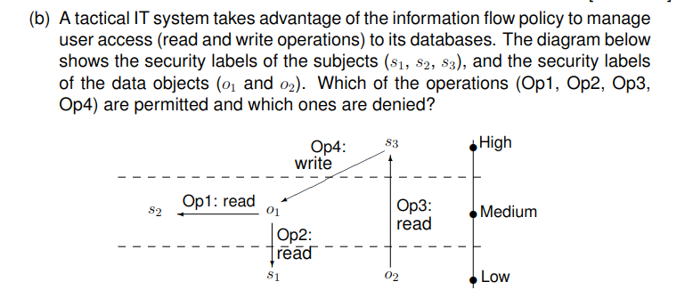

### op 1 ,2 ,3  permitted, op 4 denied

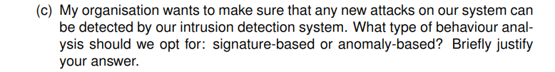

### anomaly based detection because it can detect new/unknown attacks if they deviate from normal behavior.

