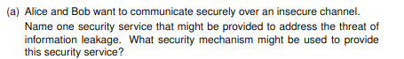
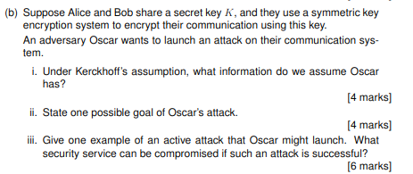
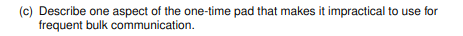
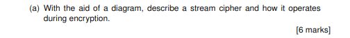
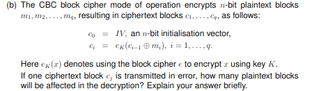
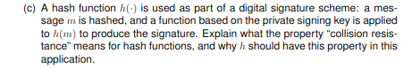
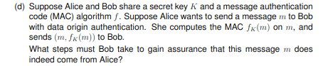
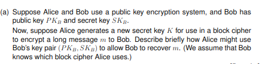
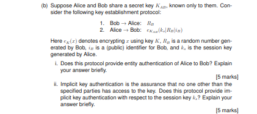
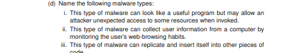

# paper 24

## Question 1

### Security service would be Confidentiality. This ensures that data can not be seen by those who are not autharised to do so.

### A security mechansim used to provide this service is Encryption. This is when we turn plaintext(a client's data) into ciphertext using a combination of keys and algorithms.

### i . We assume Oscar knows the Encryption/decryption algorithms and ciphertext. The Security relies on within the key. 

### ii . One possible goal of Oscar might be too read the plaintext from the ciphertext

### iii . An active attack could be to delete data in it's transmission. Avalability would be comprimised.

### It can only be used once and the key must be as long as the plaintext message.

## Question 2

    Secret key --> keystream Generator --> Keystream
                              |
    Plaintext ----------------0----------> Ciphertext
                              xor

### A stream cipher is a symetric key cipher where plaintext bits are encrypted one at a time with a corresponding pseudorandom bit

###     Affected Blocks: 2 (mj and mj+1).
###     CBC’s dependency on the previous ciphertext block during decryption.

### A hash function h(⋅)h(⋅) is collision-resistant if it is computationally infeasible to find two distinct inputs m1m1​ and m2m2​ such that:
### h(m1)=h(m2).

###     Collision resistance prevents attackers from exploiting hash collisions to forge signatures.

### Essential for Security: Digital signatures rely on the hash function’s inability to produce collisions; otherwise, the system’s trustworthiness collapses.

### 1. Receive the message m and the MAC value fK(m) from Alice.

### 2. Use the shared secret key K and the MAC algorithm f to compute a new MAC:
### 3. → Compute fK(m) on the received message.

### 4. Compare the computed MAC with the received MAC:

### 5. If they match, the message is accepted as authentic (i.e., from Alice).

### 6. If they do not match, the message is rejected (it may have been tampered with or forged).

### 7. This process provides data origin authentication, since only someone with the key K (i.e., Alice) could generate the correct MAC.

## Question 3

### This is  hybrid encryption, combining public-key and symmetric-key cryptography for secure communication.

### i. Yes, the protocol provides entity authentication of alice to bob
### Bob sends a fresh challenge Rn (random nonce).
### Alice responds by encrypting with the shared key .
### ii. Yes, the protocol provides implicit key authentication for Ku

### i. Non repudiation means a sender cant deny having sent a mesagge they sent.. It provides proof of origin 
### ii. The signiture servers as undeniable proofthat that Alice sent M
### iii. yes
### iv. No

## Question 4

### We use Access control To ensure integrity and confidentiallity of a system to ensure only those who need access can obtain it. This prevents a malicious user to intefere with secure data. This enforecs the princible of least privilege.

### AN ACL is a column-wise implementation od the access control matrix. example:
    File1: [(Alice, read), (Bob, read+write)]  
    File2: [(Alice, execute), (Charlie, read)]  

### A disadvantage of ACL isthat administrators must check every object's ACL when revoking user access across all objects. which is time consuming.

### Defense In Depth. Implement multiple layers of security controls so that if one layer fails, others still protect the system.

### i. Trojan horse
### ii. Spyware
### iii. Worm/virus