# 25 practice paper

## Question 1- Security Concepts, elements of cryptography.

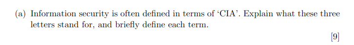

### CIA refers to:
    Confidentiality-  Only those who absoulutely require access to data should have it.
    Integrity- Data can not be alatered or tampered with by those who shouldnt have it. mechansims should be used to keep data secret.
    Avalability- Data Should be readily avaliable to valid users easily and quickly, and should only be avalabible to valid users.

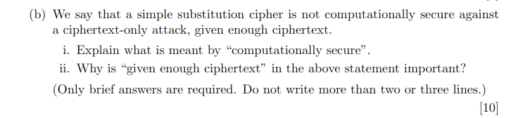

### i. Computationally secure refers toa cryptosystem being unbreakable given a feasible amount of resources.
### ii. "Given enough ciphertext" is important as statistical analysis can be preformed on it. such as analysing bigrams or trigrams such as "am", "in", "the", "ing".

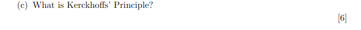

### Kerchoffs Princible is about assumung an attacker knows the encryption/decryption Algorithms . We would assume an attacker has these as well as ciphertext. So we should ensure security it kept within the key.

## Question 2- Symmetric key crptography, integrity mechanisms

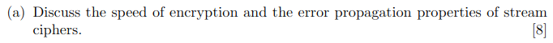

### Stream ciphers are very fast nd error propagation is very low. Both of these is due to the fact that that bits are encrypted and sent 1 by 1 so they may travel quickly as well as if one or 2 bits are lossed, no real data can be stolen.

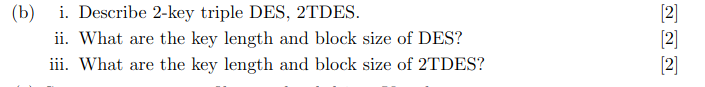

### i.  2-key  is about encrypting plaintext with key 1, decrypt it with key 2, encrypt again with key 1.

### ii. 56 bit key length and 64 block size

### iii. 112 bit key length 64 bit block size

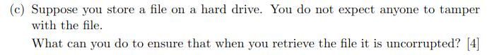

### We can use hashing such SHA-256 on the file and compare the file with the hash to ensure it hasn't been tampered with. 

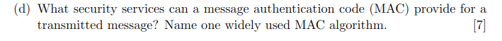

### Integrity and authentication. 
### HMAC(Hashed based MAC)

## Question 3- Public key cryptography,entity authentication, digital signiture, key esablishment

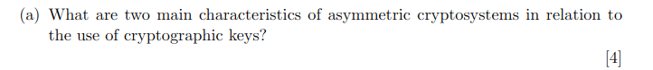

### 2 linked keys . 1 public key, 1 private key.
### No need for pre shared secrets.

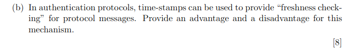

### Advantage: an attack could only occur in a  small timeframe that they are unliekly to know about. It does not require extra stepts to verify freshness. It will automaticallt reject expired timeframes.
### Disadvantage: Require synronchised clocks.

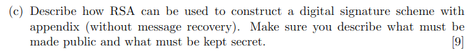

### To create an RSA digital signature, Alice:

    Hashes the message (using SHA-256) and encrypts the hash with her private key to make the signature.

    Sends both the original message and the signature to Bob.

### Bob verifies it by:

    Decrypting the signature with Alice’s public key to get the hash.

    Comparing it to a fresh hash of the received message. If they match, the signature is valid.

### What’s public/secret?

    Public: The modulus and encryption exponent.

    Secret: The decryption exponent.

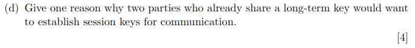
### Exposure of the long-term key- Protects past communications even if the long-term key is leaked later.

## Question 4: Computer and Network Security

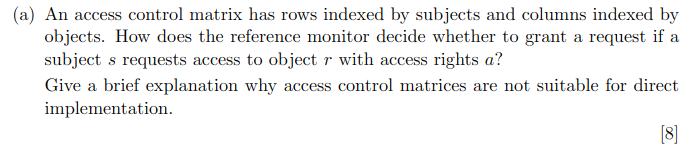

    Step 1: The reference monitor checks the access control matrix at cell (s,r) (where row = subject s, column = object r).

    Step 2: If the requested right aa (e.g., read, write) is listed in the matrix for (s,r)(s,r), access is granted. Otherwise, it is denied.

### They can be time consuming when it comes to managing, adding or deleting acress controls of a user
### Inefficent as most entires will be null which wastes a lot of memmory space.

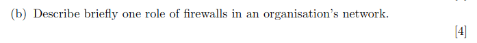

### Firewalls are used to manage and filter the entire traffic of a system to ensure only valid files and users are inside the system. It should block known attacks and malcious use.

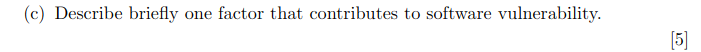

### Insuffcient Access control would allow a user to steal data from their company and sell it. This could be achieved if least privlage princble isnt used.

### Poor input validation could lead to an attack such as an SQL attack to occur as any input could go into a system.

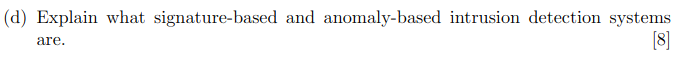

### Signiture based: Compares network traffic or system activity against a database of known attack patterns (signatures).

### Anomoly based:     Establishes a baseline of "normal" behavior (e.g., typical network traffic, user activity). Flags deviations (e.g., unusual login times, spikes in data transfers).