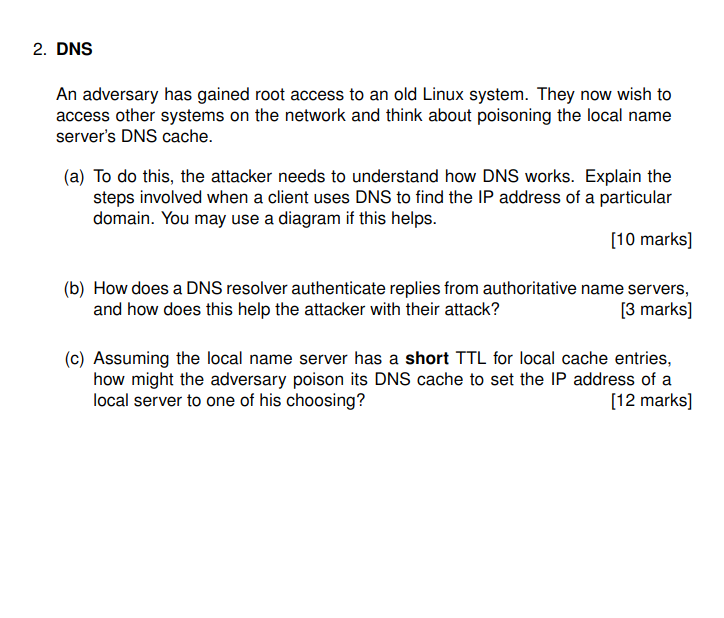

# 1 


# True/False IT Security Questions

(a) **FALSE.** The Ware report's diagram is still applicable to modern IT security. Its core principles of confidentiality, integrity, and availability (CIA triad) remain fundamental to security frameworks today, even as technologies evolve. Example: Zero-trust security models still protect these same core attributes.

(b) **FALSE.** Data in process memory often includes untyped or loosely typed information. Many programming languages (like C) allow raw memory manipulation without enforcing type information, and memory can contain arbitrary binary data without explicit type metadata.

(c) **FALSE.** TCP handshake doesn't prevent man-in-the-middle attacks. The handshake establishes connections but has no built-in authentication mechanism. An attacker can intercept the handshake packets and establish separate connections with both parties, relaying information between them.

(d) **FALSE.** DNS by itself provides virtually no integrity guarantees. Traditional DNS sends queries and responses unencrypted and unauthenticated, making it vulnerable to cache poisoning and spoofing attacks. DNSSEC was specifically developed to address these integrity issues.

(e) **FALSE.** If a script from london.ac.uk makes a request to royalholloway.ac.uk, cookies for london.ac.uk will not be included automatically. Browsers only send cookies to the domain they belong to (same-origin policy), unless specifically configured with special attributes for cross-origin sharing.

(f) **TRUE.** Reflected XSS attacks exploit vulnerabilities in how web applications handle user input that gets immediately reflected back in responses. The database system itself isn't the vulnerability; rather, it's the web application's failure to properly sanitize or escape user input before rendering it.

(g) **TRUE.** Process gates are a technique used to prevent reference monitors from being bypassed. They control how processes can call privileged operations, ensuring security checks cannot be circumvented when transitioning between privilege levels.

(h) **FALSE.** Unprivileged processes cannot modify the UNIX system clock. Changing the system time requires root/administrator privileges specifically to prevent unprivileged users from tampering with time-sensitive operations like authentication and logging.

(i) **FALSE.** UNIX user groups do not always have the same ID number as the user's UID. Groups have their own identifiers (GIDs) that are separate from user IDs, allowing users to belong to multiple groups and for groups to contain multiple users.

(j) **FALSE.** SYN cookies don't have a secure flag as they're not HTTP cookies. They're a TCP-level mechanism to prevent SYN flood attacks by avoiding the need to store connection state during the TCP handshake. HTTP cookies can have the secure flag, but SYN cookies are entirely different.

(k) **TRUE.** MULTICS introduced fundamental access control concepts that influenced modern operating systems, including hierarchical file systems, access control lists, protection rings, and the principle of least privilege that remain core to modern OS security models.

(l) **FALSE.** PCs in the 1980s had minimal security controls. Early personal computers like the IBM PC, Apple II, and early DOS systems lacked user authentication, process isolation, memory protection, and access controls. Multiple users could access all files and resources on the system.


# 2 



# DNS Cache Poisoning Attack

## (a) DNS Resolution Process

When a client resolves a domain name to an IP address:

1. **Client checks local cache** for the domain name
2. If not found, client sends query to its **recursive DNS resolver**
3. Resolver checks its own cache; if not found, begins resolution process
4. Resolver queries a **root server** which directs to the appropriate TLD server
5. Resolver queries the **TLD server** (e.g., .com) which provides the authoritative nameserver
6. Resolver queries the **authoritative nameserver** which returns the IP address
7. Resolver **caches the result** according to TTL and returns it to the client

Each DNS query/response includes:
- Transaction ID (16-bit)
- Query information (domain, record type)
- Response data (for replies)

```
Client                Recursive                Root               TLD                Auth
  |                     Resolver               Server             Server             Server
  |                        |                     |                  |                  |
  |---Query example.com-->|                     |                  |                  |
  |                        |--Query example.com->|                  |                  |
  |                        |<--TLD server for .com--|              |                  |
  |                        |---Query example.com--->|              |                  |
  |                        |<--Auth server for example.com--|      |                  |
  |                        |------Query example.com---------->|    |                  |
  |                        |<---------IP for example.com------|    |                  |
  |<--IP for example.com--|                     |                  |                  |
```

## (b) DNS Resolver Authentication Weaknesses

Standard DNS resolvers attempt to authenticate replies by:
1. Matching transaction IDs
2. Verifying source address
3. Confirming query name/type match

These methods help the attacker because:
- No cryptographic authentication in standard DNS
- Transaction IDs are only 16 bits (easily guessable)
- UDP is connectionless, allowing source address spoofing
- Race conditions allow spoofed responses to arrive before legitimate ones

## (c) DNS Cache Poisoning Technique

With root access and short TTLs, the adversary can:

1. **Monitor DNS traffic** using packet capture tools
2. **Wait for cache entries to expire** (short TTL makes this quick)
3. **Inject malicious records** directly into cache files or memory
4. **Modify resolver configuration** to use compromised DNS servers
5. **Execute a Kaminsky-style attack**:
    - Generate queries for random subdomains
    - Send spoofed responses before legitimate ones arrive
    - Include additional "glue records" pointing the main domain to attacker's IP
6. **Verify and exploit** the poisoned cache to redirect traffic to malicious servers

The short TTL helps the attacker by allowing rapid retry of failed poisoning attempts.


# 3 


# Linux System Security Solutions

## 3(a) Creating the IncidentsReports Folder

To create a folder in the root directory with the specified permissions:

```bash
# Create the directory
sudo mkdir /IncidentsReports

# Set user2 as owner and even as group
sudo chown user2:even /IncidentsReports

# Set permissions: user2 can read/write/delete, prime group can write, no access for others
sudo chmod 750 /IncidentsReports

# Set the setgid bit so new files inherit the group
sudo chmod g+s /IncidentsReports

# Set the default ACL for prime group to have write access
sudo setfacl -d -m g:prime:w /IncidentsReports

# Prevent non-user2 users from deleting files
sudo setfacl -d -m u:user2:rwx /IncidentsReports
sudo setfacl -d -m g::r /IncidentsReports
sudo setfacl -d -m o::- /IncidentsReports
```

## 3(b) Access Control Lists

### i. ACL for read rights to the files:
```bash
# Allow user2 (owner) to read
setfacl -m u:user2:r IR1 IR2 IR3 IR4
# Allow even group to read
setfacl -m g:even:r IR1 IR2 IR3 IR4
# Deny read access to others
setfacl -m o::- IR1 IR2 IR3 IR4
```

### ii. ACL for write rights to the directory:
```bash
# Allow user2 (owner) to write to directory
setfacl -m u:user2:w /IncidentsReports
# Allow prime group to write to directory
setfacl -m g:prime:w /IncidentsReports
# Deny write access to others
setfacl -m o::- /IncidentsReports
```

## 3(c) Security Violation Analysis

Yes, there is a security violation in the commands executed by user2. The issue involves a classic time-of-check to time-of-use (TOCTOU) race condition vulnerability.

**Analysis:**

1. `ln /IncidentsReports/IR3 v512IR`: Creates a hard link named v512IR pointing to IR3, meaning they're the same file with two different names.

2. `touch v512update`: Creates an empty file called v512update.

3. `echo "Delays to v512 due to incident." > v512update`: Writes text to v512update.

**Security violation details:**

- The hard link (v512IR) creates an alternate access path to IR3 that bypasses the intended access controls.
- If IR3 had restricted permissions in the ACL, creating a hard link in a different location could circumvent these restrictions.
- Since user2 owns both directories, they've created a situation where:
    - Users with access to v512IR might now have access to IR3's content without having appropriate permissions in the /IncidentsReports directory
    - Changes made to v512IR would directly modify IR3
    - The ACLs of the /IncidentsReports directory are bypassed

**Effect of the violation:**
- Anyone with access to the location of v512IR can potentially read or modify IR3, bypassing the carefully configured permission structure
- This undermines the integrity of the incident report data
- It creates a persistent security issue as long as the hard link exists
- The permission model becomes ineffective since there are now two paths to the same file content with potentially different permission sets

## 3(c)

## Why Exploitable
- The code uses `strcpy(lbuf, argv[1])` which performs no bounds checking
- If `argv[1]` exceeds 512 bytes, it will overflow the `lbuf` buffer
- On x86-32, this overflow can overwrite the return address stored on the stack

## Executing Arbitrary Code
Yes, shell execution is possible through these steps:

1. Create payload: `[NOP SLED][SHELLCODE][PADDING][RETURN ADDRESS]`
2. Make return address point to our shellcode in the buffer
3. When `main()` returns, execution jumps to the shellcode
4. Shellcode executes with program's privileges, spawning a shell

This works because x86-32 allows stack execution by default and has predictable memory layout in simple programs without protections.

# 4


# Web Security: XSS and SQL Injection

## (a) Cross-Site Scripting (XSS)

### i. Main Vulnerability Leading to XSS
Insufficient validation and sanitization of user input that is later rendered as part of HTML output, allowing injection of executable script code.

### ii. General Principle of XSS Attacks
XSS attacks involve injecting malicious client-side scripts into web pages viewed by other users. When the victim's browser loads the compromised page, it executes the injected script in the context of the user's session. The attack evades and exploits the Same-Origin Policy, which normally restricts how scripts from one origin can interact with resources from another origin. By executing within the context of the trusted site, the malicious script bypasses this security boundary.

### iii. Stored XSS vs. Reflected XSS
- **Stored XSS**: Malicious script is permanently stored on the target server (in a database, message forum, comment field, etc.). The script is served to victims when they request the compromised content. This is more dangerous as it affects anyone who views the infected page and doesn't require targeted delivery.
- **Reflected XSS**: Malicious script is embedded in a URL and only activates when a victim clicks a specially crafted link. The script is "reflected" from the web server in the response, but not permanently stored. This requires social engineering to trick users into clicking malicious links.

## (b) SQL Injection

### i. SQL Injection Description
SQL injection occurs when unsanitized user input is incorporated into SQL queries, allowing attackers to modify query logic. By inserting SQL commands rather than expected data, attackers can bypass authentication, access sensitive data, or manipulate database contents. This succeeds when applications fail to parameterize queries or properly validate input.

### ii. Malicious Email Input

```
anything' OR 1=1; DROP TABLE foo; --
```


