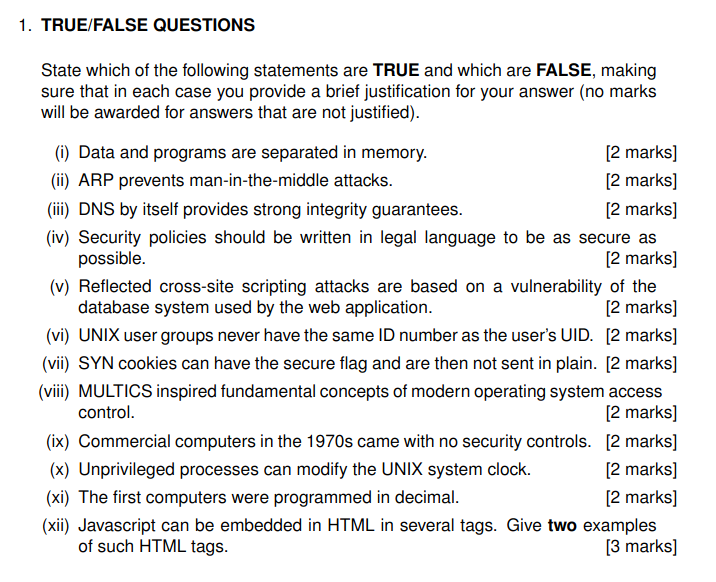
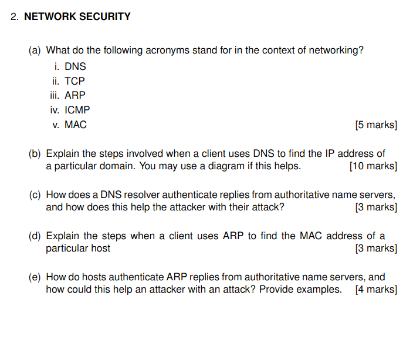
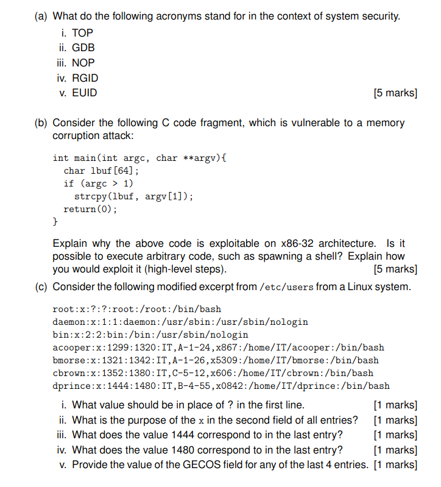
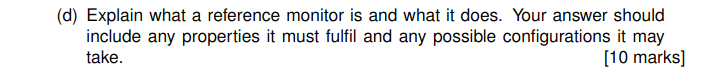
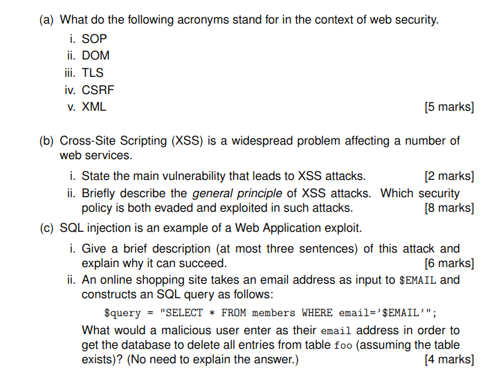

# 1 



## True/False Questions with Justifications

(i) Data and programs are separated in memory. **TRUE** [2 marks]
- Modern computer architectures implement memory segmentation that separates code (text segment) from data segments. This separation is a fundamental security principle called "W^X" (Write XOR Execute) that prevents memory regions from being both writable and executable simultaneously.

(ii) ARP prevents man-in-the-middle attacks. **FALSE** [2 marks]
- ARP has no authentication mechanisms and is vulnerable to ARP spoofing/poisoning. These vulnerabilities actually make ARP a common vector for performing man-in-the-middle attacks.

(iii) DNS by itself provides strong integrity guarantees. **FALSE** [2 marks]
- Standard DNS lacks authentication mechanisms, making it vulnerable to spoofing and cache poisoning attacks. DNSSEC was later developed specifically to address these integrity and authentication weaknesses.

(iv) Security policies should be written in legal language to be as secure as possible. **FALSE** [2 marks]
- Security policies should be clear and understandable to all stakeholders to ensure proper implementation. Complex legal language often leads to misinterpretation and non-compliance.

(v) Reflected cross-site scripting attacks are based on a vulnerability of the database system used by the web application. **FALSE** [2 marks]
- Reflected XSS attacks exploit improper input validation in web applications, not database vulnerabilities. They occur when untrusted user input is immediately returned by a web server without proper sanitization.

(vi) UNIX user groups never have the same ID number as the user's UID. **FALSE** [2 marks]
- There is no technical restriction preventing a group ID (GID) from having the same numeric value as a user ID (UID). The system treats them as separate entities even if they share the same number.

(vii) SYN cookies can have the secure flag and are then not sent in plain. **FALSE** [2 marks]
- SYN cookies are TCP sequence numbers used to prevent SYN flood attacks, not browser cookies. The "secure flag" applies only to HTTP cookies, making this statement a confusion of two unrelated technologies.

(viii) MULTICS inspired fundamental concepts of modern operating system access control. **TRUE** [2 marks]
- MULTICS pioneered access control concepts still fundamental today, including protection rings and access control lists. UNIX, which heavily influenced modern operating systems, was developed as a simplified version of MULTICS.

(ix) Commercial computers in the 1970s came with no security controls. **FALSE** [2 marks]
- 1970s systems like IBM's System/370 with RACF and MULTICS had implemented authentication and access controls. These early systems had basic security mechanisms including user authentication and privilege separation.

(x) Unprivileged processes can modify the UNIX system clock. **FALSE** [2 marks]
- Modifying the system clock in UNIX/Linux requires root/administrative privileges. Allowing unprivileged processes to change the system time would create security vulnerabilities like audit log tampering.

(xi) The first computers were programmed in decimal. **TRUE** [2 marks]
- Early computers like ENIAC (1945) used decimal number systems before binary programming became standard. ENIAC was programmed by physically setting switches and connecting cables to represent decimal values.

(xii) Javascript can be embedded in HTML in several tags. Give two examples of such HTML tags. **TRUE** [3 marks]
- JavaScript can be embedded in the `<script>` tag, which is the primary method for including JavaScript code. It can also be included in event handler attributes of HTML elements like `<button onclick="myFunction()">`.

# 2 



# Network Security

## (a) What do the following acronyms stand for in the context of networking?

i. DNS - Domain Name System
ii. TCP - Transmission Control Protocol
iii. ARP - Address Resolution Protocol
iv. ICMP - Internet Control Message Protocol
v. MAC - Media Access Control

[5 marks]

## (b) Explain the steps involved when a client uses DNS to find the IP address of a particular domain.

1. **DNS Query Initiation**: The client enters a domain name (e.g., example.com) in their browser, which needs to be resolved to an IP address.

2. **Local DNS Cache Check**: The client first checks its local DNS cache to see if this domain has been resolved recently.

3. **Query to Recursive Resolver**: If not in the cache, the client sends a query to its configured DNS resolver (typically provided by the ISP or a third-party like Google's 8.8.8.8).

4. **Root Server Query**: If the recursive resolver doesn't have the answer cached, it queries a root DNS server, which responds with the address of the appropriate Top-Level Domain (TLD) server (e.g., .com TLD server).

5. **TLD Server Query**: The recursive resolver queries the TLD server, which responds with the address of the authoritative name server for the specific domain.

6. **Authoritative Name Server Query**: The recursive resolver queries the authoritative name server, which responds with the IP address for the requested domain.

7. **Response to Client**: The recursive resolver returns the IP address to the client.

8. **Caching**: Both the client and the recursive resolver cache this information for a period specified by the Time-To-Live (TTL) value to speed up future requests.

```
Client                Recursive Resolver           Root Server
  |                          |                         |
  |---DNS query------------->|                         |
  |                          |---Query for TLD-------->|
  |                          |<--TLD server address----|
  |                          |                         |
  |                          |         TLD Server      |
  |                          |            |            |
  |                          |---Query for Auth NS---->|
  |                          |<--Auth NS address-------|
  |                          |                         |
  |                          |     Authoritative NS    |
  |                          |            |            |
  |                          |---Query for IP--------->|
  |                          |<--IP address------------|
  |                          |                         |
  |<--IP address response----|                         |
  |                          |                         |
```

[10 marks]

## (c) How does a DNS resolver authenticate replies from authoritative name servers, and how does this help the attacker with their attack?

Standard DNS has no built-in authentication mechanism for replies from authoritative name servers. This lack of authentication means a DNS resolver cannot verify that responses actually came from the legitimate authoritative server. This vulnerability helps attackers execute DNS spoofing or cache poisoning attacks, where they can intercept DNS queries and return false IP addresses that direct users to malicious websites without detection.

[3 marks]

## (d) Explain the steps when a client uses ARP to find the MAC address of a particular host

1. **Need Identification**: When a host has an IP packet to send to another host on the same network, it needs the destination's MAC address.

2. **ARP Request**: The sender broadcasts an ARP request packet to all devices on the local network (FF:FF:FF:FF:FF:FF) containing the target IP address, essentially asking "Who has this IP address?"

3. **ARP Reply**: Only the host with the matching IP address responds with an ARP reply containing its MAC address.

4. **ARP Cache Update**: The sender receives the reply and updates its ARP cache (a temporary table mapping IP addresses to MAC addresses).

5. **Packet Transmission**: The sender can now encapsulate the IP packet in an Ethernet frame with the correct destination MAC address and send it.

[3 marks]

## (e) How do hosts authenticate ARP replies from authoritative name servers, and how could this help an attacker with an attack? Provide examples.

Hosts do not authenticate ARP replies as the ARP protocol has no built-in authentication mechanism. This lack of authentication means any device on the network can send an ARP reply claiming to be associated with any IP address. This vulnerability enables several attack vectors:

1. **ARP Spoofing/Poisoning**: An attacker can send fake ARP messages to associate their MAC address with a legitimate IP address (like the default gateway). This creates a man-in-the-middle position where all traffic meant for that IP passes through the attacker's machine.

2. **MAC Flooding**: Attackers can overwhelm switches with fake MAC addresses, potentially causing the switch to act like a hub and broadcast all packets to all ports.

3. **Denial of Service**: By continuously sending conflicting ARP information, attackers can disrupt network communication between legitimate hosts.

4. **Session Hijacking**: After performing ARP poisoning, attackers can intercept and potentially modify unencrypted session data.

Note: The question contains an error in phrasing - ARP replies don't come from "authoritative name servers" as ARP is a local network protocol that operates independently from DNS.

[4 marks]

# 3 






## (a) What do the following acronyms stand for in the context of system security.

i. **TOP** - Trusted Operating Platform
ii. **GDB** - GNU Debugger
iii. **NOP** - No Operation
iv. **RGID** - Real Group ID
v. **EUID** - Effective User ID

[5 marks]

## (b) Consider the following C code fragment, which is vulnerable to a memory corruption attack:

```c
int main(int argc, char **argv){
    char lbuf[64];
    if (argc > 1)
        strcpy(lbuf, argv[1]);
    return(0);
}
```

### Explanation of vulnerability and exploitation:

The code is vulnerable to a buffer overflow attack because `strcpy()` copies data from `argv[1]` to `lbuf` without checking the size of the input. The buffer `lbuf` is only 64 bytes, but `strcpy()` will continue copying until it encounters a null terminator in the source string, potentially writing beyond the allocated buffer space.

On x86-32 architecture, this is exploitable for arbitrary code execution because:

1. Local buffers are allocated on the stack
2. The return address of the function is stored on the stack
3. When the buffer overflow occurs, an attacker can overwrite the return address

To exploit this vulnerability and spawn a shell:

1. Craft a payload that includes:
    - Shellcode (machine instructions to execute `/bin/sh`)
    - Padding to reach the saved return address
    - A new return address pointing back to the beginning of our shellcode

2. Exploitation steps:
    - Determine the exact offset to the return address (typically through debugging)
    - Place the shellcode at the beginning of the buffer
    - Fill the middle with NOP instructions (creating a "NOP sled")
    - Overwrite the return address to point to somewhere in the NOP sled
    - When the function returns, execution will jump to our shellcode and spawn a shell

This works because the stack is both writable and executable on traditional x86-32 systems without protections like DEP/NX bit, ASLR, or stack canaries.

[5 marks]

## (c) Consider the following modified excerpt from /etc/passwd from a Linux system.

```
root:x:?:?:root:/root:/bin/bash
daemon:x:1:1:daemon:/usr/sbin:/usr/sbin/nologin
bin:x:2:2:bin:/bin:/usr/sbin/nologin
acooper:x:1299:1320:IT,A-1-24,x867:/home/IT/acooper:/bin/bash
bmorse:x:1321:1342:IT,A-1-26,x5309:/home/IT/bmorse:/bin/bash
cbrown:x:1352:1380:IT,C-5-12,x606:/home/IT/cbrown:/bin/bash
dprince:x:1444:1480:IT,B-4-55,x0842:/home/IT/dprince:/bin/bash
```

i. **What value should be in place of ? in the first line?**

The values that should be in place of the question marks in the first line are `0:0`. These represent the UID (User ID) and GID (Group ID) for the root user, which are both conventionally set to 0 in Unix/Linux systems.

[1 mark]

ii. **What is the purpose of the x in the second field of all entries?**

The `x` in the second field indicates that the encrypted password is stored in the shadow password file (`/etc/shadow`) rather than in `/etc/passwd` itself. This is a security measure that prevents non-privileged users from accessing the password hashes.

[1 mark]

iii. **What does the value 1444 correspond to in the last entry?**

The value `1444` corresponds to the UID (User ID) of the user `dprince`. This is a unique identifier for this user in the system.

[1 mark]

iv. **What does the value 1480 correspond to in the last entry?**

The value `1480` corresponds to the GID (Group ID) of the user `dprince`. This identifies the primary group to which the user belongs.

[1 mark]

v. **Provide the value of the GECOS field for any of the last 4 entries.**

The GECOS field for `dprince` is `IT,B-4-55,x0842`. This field typically contains comma-separated information about the user, including their full name, office location, office phone, and other contact information.

[1 mark]

## (e)

### Reference Monitor
#### Definition
- A reference monitor is a security mechanism that mediates all access attempts between subjects (users/processes) and objects (files/resources) in a computer system, enforcing access control policies.

#### Essential Properties

- Complete Mediation: Must intercept all access requests with no bypasses possible
- Tamperproof: Must be protected from unauthorized modification
- Verifiable: Must be simple enough to be thoroughly tested and validated

# 4 



# Web Security Answers

## (a) What do the following acronyms stand for in the context of web security.

i. **SOP** - Same-Origin Policy
ii. **DOM** - Document Object Model
iii. **TLS** - Transport Layer Security
iv. **CSRF** - Cross-Site Request Forgery
v. **XML** - eXtensible Markup Language

[5 marks]

## (b) Cross-Site Scripting (XSS) is a widespread problem affecting a number of web services.

### i. State the main vulnerability that leads to XSS attacks.

The main vulnerability that leads to XSS attacks is insufficient validation or sanitization of user-supplied input that is later incorporated into web pages and executed by the browser.

[2 marks]

### ii. Briefly describe the general principle of XSS attacks. Which security policy is both evaded and exploited in such attacks.

The general principle of XSS attacks involves injecting malicious client-side scripts (typically JavaScript) into web pages viewed by other users. When these users visit the affected page, the malicious script executes within their browser context, allowing attackers to steal sensitive information (like cookies or session tokens), redirect users to malicious sites, or perform actions on behalf of the victim.

The security policy that is both evaded and exploited in XSS attacks is the Same-Origin Policy (SOP). XSS attacks evade SOP by injecting code that appears to originate from the trusted website, thus running within that site's origin and gaining access to its cookies, tokens, and DOM. This exploits SOP because once the malicious code is executing within the target origin, SOP actually protects the attacker by allowing the injected script full access to the site's resources while preventing detection from external domains.

[8 marks]

## (c) SQL injection is an example of a Web Application exploit.

### i. Give a brief description (at most three sentences) of this attack and explain why it can succeed.

SQL injection is an attack where malicious SQL code is inserted into input fields that are inadequately validated, allowing attackers to manipulate the database queries executed by the application. The attack succeeds because the application fails to properly separate data from code, causing the database to interpret the injected input as part of the SQL command rather than as data parameters. This vulnerability often arises from direct concatenation of user input into SQL queries without proper sanitization, parameterization, or input validation.

[6 marks]

### ii. An online shopping site takes an email address as input to $EMAIL and constructs an SQL query as follows:
```
$query = "SELECT * FROM members WHERE email='$EMAIL'";
```
What would a malicious user enter as their email address in order to get the database to delete all entries from table foo (assuming the table exists)? (No need to explain the answer.)

```
' OR 1=1; DROP TABLE foo; --
```

[4 marks]
