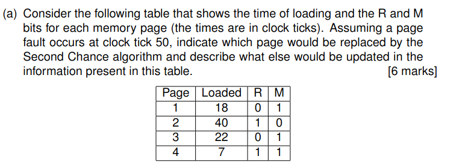
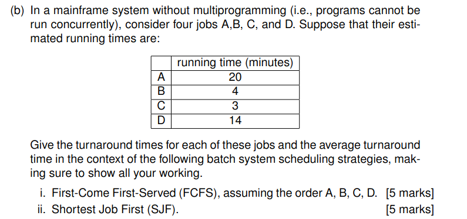
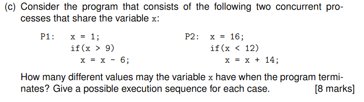
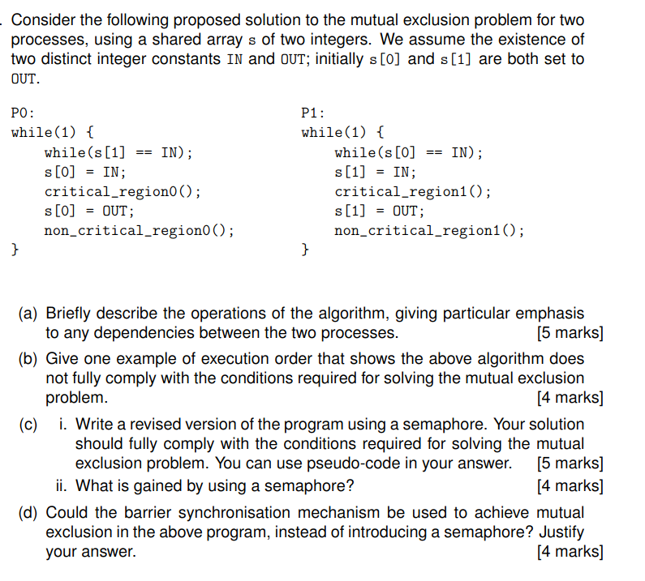
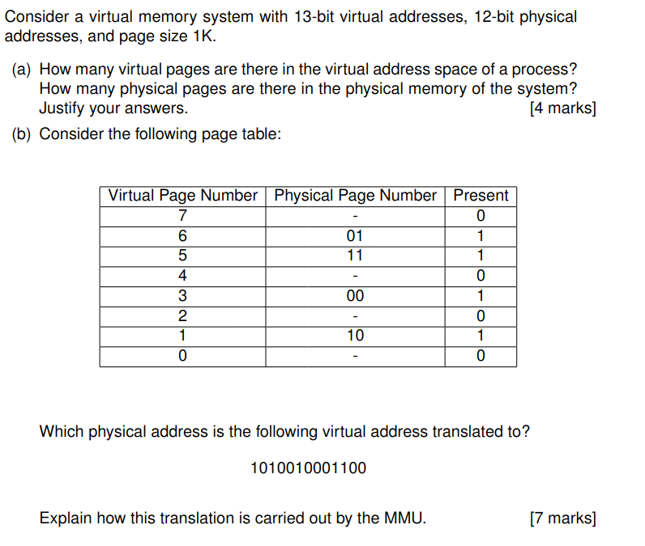
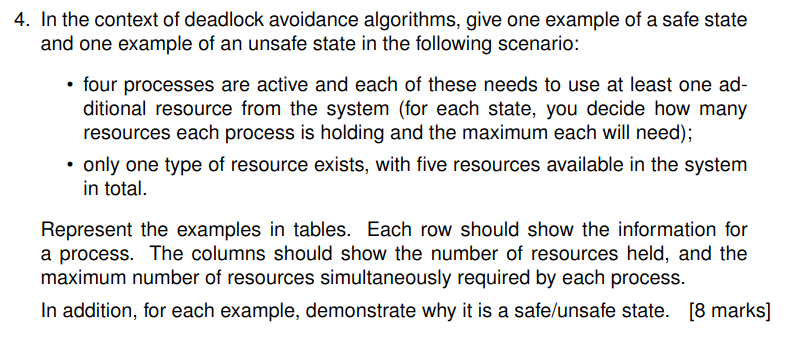
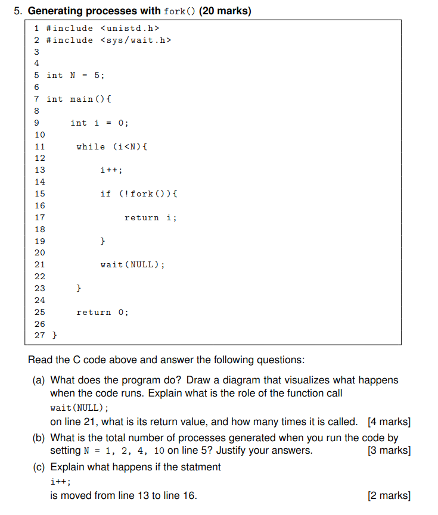
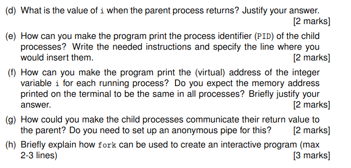

# OS Paper 21

# 1 



## Second Chance Algorithm Analysis

### Page Replacement Decision
- Page 1 would be replaced according to the Second Chance algorithm.

### Analysis:
1. The Second Chance algorithm examines pages in order of loading time (FIFO basis)
2. Starting with oldest page (Page 4, loaded at tick 7):
- Page 4 has R=1, so it gets a second chance
- R bit reset to 0
- Conceptually moved to end of queue (load time updated)
3. Next oldest page (Page 1, loaded at tick 18):
- Has R=0 (no second chance)
- Selected for replacement

### Table Updates:
| Page | Loaded | R | M | Update |
|------|--------|---|---|--------|
| 1    | 18     | 0 | 1 | Replaced by new page |
| 2    | 40     | 1 | 0 | Unchanged |
| 3    | 22     | 0 | 1 | Unchanged |
| 4    | 50     | 0 | 1 | R bit reset, load time updated to 50 |
| New  | 50     | 1 | 0 | New page added with R=1, M=0 |

The M=1 for Page 1 indicates it's modified, requiring write-back to disk before replacement.



## Batch Scheduling Analysis

### Given Information:
| Job | Running Time (minutes) |
|-----|------------------------|
| A   | 20                     |
| B   | 4                      |
| C   | 3                      |
| D   | 14                     |

### i. First-Come First-Served (FCFS) with order A, B, C, D

**Working:**
- Job A: Start = 0, Finish = 20
- Turnaround = 20 - 0 = 20 minutes
- Job B: Start = 20, Finish = 24
- Turnaround = 24 - 0 = 24 minutes
- Job C: Start = 24, Finish = 27
- Turnaround = 27 - 0 = 27 minutes
- Job D: Start = 27, Finish = 41
- Turnaround = 41 - 0 = 41 minutes

**Turnaround Times:**
- A: 20 minutes
- B: 24 minutes
- C: 27 minutes
- D: 41 minutes

**Average Turnaround Time:**
(20 + 24 + 27 + 41) / 4 = 112 / 4 = 28 minutes

### ii. Shortest Job First (SJF)

**Working:**
- Job C (shortest): Start = 0, Finish = 3
- Turnaround = 3 - 0 = 3 minutes
- Job B (next shortest): Start = 3, Finish = 7
- Turnaround = 7 - 0 = 7 minutes
- Job D (next shortest): Start = 7, Finish = 21
- Turnaround = 21 - 0 = 21 minutes
- Job A (longest): Start = 21, Finish = 41
- Turnaround = 41 - 0 = 41 minutes

**Turnaround Times:**
- A: 41 minutes
- B: 7 minutes
- C: 3 minutes
- D: 21 minutes

**Average Turnaround Time:**
(41 + 7 + 3 + 21) / 4 = 72 / 4 = 18 minutes




## Concurrent Program Analysis

The variable `x` can have **5 different values** when the program terminates:

### Final value: x = 1
```
1. P2: x = 16
2. P2: if(x < 12) → false
3. P1: x = 1
4. P1: if(x > 9) → false
```

### Final value: x = 10
```
1. P1: x = 1
2. P2: x = 16
3. P2: if(x < 12) → false
4. P1: if(x > 9) → true
5. P1: x = x - 6 → x = 10
```

### Final value: x = 15
```
1. P2: x = 16
2. P1: x = 1
3. P1: if(x > 9) → false
4. P2: if(x < 12) → true
5. P2: x = x + 14 → x = 15
```

### Final value: x = 16
```
1. P1: x = 1
2. P1: if(x > 9) → false
3. P2: x = 16
4. P2: if(x < 12) → false
```

### Final value: x = 24
```
1. P1: x = 1
2. P2: x = 16
3. P1: if(x > 9) → true
4. P1: x = x - 6 → x = 10
5. P2: if(x < 12) → true
6. P2: x = x + 14 → x = 24
```


# 2 



### (a) Algorithm Operations Description

This algorithm attempts to implement mutual exclusion using a shared array `s` with two elements:

1. **Process P0:**
    - Enters an infinite loop where it:
        - Waits until `s[1]` is not `IN` (busy waiting)
        - Sets `s[0] = IN` to indicate its intention to enter critical section
        - Executes its critical section
        - Sets `s[0] = OUT` to indicate it has left critical section
        - Executes non-critical region code

2. **Process P1:**
    - Enters an infinite loop where it:
        - Waits until `s[0]` is not `IN` (busy waiting)
        - Sets `s[1] = IN` to indicate its intention to enter critical section
        - Executes its critical section
        - Sets `s[1] = OUT` to indicate it has left critical section
        - Executes non-critical region code

**Dependencies:**
- P0 waits for P1 to not be attempting entry (checks `s[1]`)
- P1 waits for P0 to not be attempting entry (checks `s[0]`)
- This creates a circular dependency where each process checks if the other process intends to enter before indicating its own intention.

### (b) Execution Order Showing Non-Compliance

```
Initial state: s[0] = OUT, s[1] = OUT

1. P0: Tests while(1) condition → true, enters loop
2. P0: Tests while(s[1] == IN) → false (since s[1] = OUT), proceeds
3. P0: Sets s[0] = IN
4. P1: Tests while(1) condition → true, enters loop
5. P1: Tests while(s[0] == IN) → true, waits
6. P0: Begins critical_region0()
7. P0: Sets s[0] = OUT
8. P0: Begins non_critical_region0()
9. P1: Tests while(s[0] == IN) → false (now s[0] = OUT), proceeds
10. P1: Sets s[1] = IN
11. P0: Tests while(1) condition → true, enters loop again
12. P0: Tests while(s[1] == IN) → true, waits
13. P1: Begins critical_region1()
14. P1: Sets s[1] = OUT
15. P1: Begins non_critical_region1()
16. Both P0 and P1 continue execution...
```

This execution shows the algorithm violates the **Progress** requirement of mutual exclusion, because:
- If both processes are in their non-critical sections and one process (e.g., P0) wants to enter its critical section, it might be indefinitely blocked if the other process (P1) keeps setting and resetting its flag (`s[1]`) without actually entering its critical section.
- Additionally, the solution is vulnerable to a deadlock if both processes simultaneously set their flags to `IN`.

### (c) i. Revised Version Using Semaphore

```
semaphore mutex = 1;  // Initialize semaphore to 1 (available)

P0:
while(1) {
    wait(mutex);       // Attempt to acquire semaphore
    critical_region0();
    signal(mutex);     // Release semaphore
    non_critical_region0();
}

P1:
while(1) {
    wait(mutex);       // Attempt to acquire semaphore
    critical_region1();
    signal(mutex);     // Release semaphore
    non_critical_region1();
}
```

### (c) ii. Benefits of Using a Semaphore

1. **Atomicity**: Semaphore operations are atomic, eliminating race conditions that exist in the original solution.
2. **Simplicity**: The code is simpler and easier to understand, reducing the likelihood of errors.
3. **No Busy Waiting**: Processes that can't enter critical section are blocked rather than continuously consuming CPU cycles.
4. **Guaranteed Progress**: No possibility of indefinite blocking when other processes aren't in critical section.
5. **No Deadlocks**: The semaphore guarantees that deadlocks won't occur as they might in the original solution.

### (d) Barrier Synchronization for Mutual Exclusion

No, barrier synchronization would not be appropriate for achieving mutual exclusion in this program. Here's why:

1. **Different Purpose**: Barrier synchronization is designed to make all processes wait until everyone reaches a certain point before any can proceed. Mutual exclusion requires allowing exactly one process to enter a critical section at a time.

2. **Resource Access vs. Synchronization Point**: Mutual exclusion controls access to a shared resource, while barriers synchronize the progress of multiple processes at specific points.

3. **Continuous Operation**: The processes in this problem continuously loop through critical and non-critical sections. Barriers would force unnecessary synchronization of both processes, reducing parallelism.

4. **Independent Progress**: In mutual exclusion, processes should be able to make progress independently when not accessing the critical section. Barriers would force unnecessary coordination.

A semaphore (or mutex) is the appropriate synchronization primitive for this problem because it allows processes to independently request and release access to the critical section without forcing synchronization at other points of execution.


# 3 



### (a) Virtual and Physical Pages

Given information:
- 13-bit virtual addresses
- 12-bit physical addresses
- Page size: 1K (1024 bytes) = 2^10 bytes

**Number of virtual pages:**
- With page size 1K (2^10 bytes), we need 10 bits for the offset within a page
- This leaves 13 - 10 = 3 bits for the virtual page number
- Therefore, there are 2^3 = 8 virtual pages in the virtual address space

**Number of physical pages:**
- With 12-bit physical addresses and 10 bits needed for the offset
- This leaves 12 - 10 = 2 bits for the physical page number
- Therefore, there are 2^2 = 4 physical pages in the physical memory

**Justification:**
The number of pages is calculated as (address space size) / (page size)
- Virtual address space size = 2^13 bytes = 8,192 bytes
- Physical address space size = 2^12 bytes = 4,096 bytes
- Page size = 2^10 bytes = 1,024 bytes
- Virtual pages = 8,192 / 1,024 = 8 pages
- Physical pages = 4,096 / 1,024 = 4 pages

Alternatively, the number of pages can be directly calculated as 2^(number of page number bits).

### (b) Virtual Address Translation

The virtual address to translate: `1010010001100`

**Step 1: Split into Virtual Page Number (VPN) and Offset**
- Page size is 1K (2^10 bytes), so offset requires 10 bits
- Virtual address: `101` `0010001100`
    - VPN: `101` (which is 5 in decimal)
    - Offset: `0010001100` (which is 140 in decimal)

**Step 2: Look up VPN in Page Table**
- From the given page table, VPN 5 maps to physical page number `11`

**Step 3: Construct the Physical Address**
- Physical page number: `11`
- Offset from virtual address: `0010001100`
- Physical address: `11` `0010001100` = `110010001100`

**Explanation of MMU Translation Process:**
1. The MMU extracts the virtual page number (first 3 bits): `101` (5 in decimal)
2. It checks if this page is present in memory by looking at the page table's "Present" bit
    - For VPN 5, the "Present" bit is 1, indicating the page is in memory
3. The MMU retrieves the corresponding physical page number from the page table
    - For VPN 5, the physical page number is `11`
4. The MMU combines the physical page number with the offset from the original virtual address:
    - Physical page number: `11`
    - Offset: `0010001100`
    - Resulting physical address: `110010001100`
5. The MMU sends this physical address to memory for the actual memory access

If the page wasn't present (had a Present bit of 0), the MMU would have generated a page fault, and the operating system would need to load the required page from secondary storage into physical memory before the memory access could complete.

The translation maintains the offset portion unchanged because offsets represent the same location within a page, regardless of where the page is located in physical memory.

# 4 



## Deadlock Avoidance Analysis

In deadlock avoidance algorithms (like the Banker's algorithm), we distinguish between safe and unsafe states based on whether the system can guarantee that all processes can complete their execution without entering a deadlock.

Given scenario:
- Four processes (P0, P1, P2, P3)
- One type of resource with 5 instances total
- Each process needs at least one additional resource
- We need to decide allocation and maximum need for each process

### Example of a Safe State

| Process | Resources Currently Held | Maximum Need | Potential Additional Need |
|---------|--------------------------|--------------|---------------------------|
| P0      | 0                        | 1            | 1                         |
| P1      | 1                        | 2            | 1                         |
| P2      | 1                        | 3            | 2                         |
| P3      | 2                        | 4            | 2                         |
| Total   | 4                        | -            | -                         |
| Available | 1                      | -            | -                         |

**Demonstration of Safety:**

This state is safe because there exists a sequence in which all processes can complete:

1. With 1 available resource, we can allocate to P0 which needs 1 more resource.
2. P0 completes and returns 1 resource, making available = 2.
3. We can allocate to P1 which needs 1 more resource.
4. P1 completes and returns 2 resources, making available = 3.
5. We can allocate to P2 which needs 2 more resources.
6. P2 completes and returns 3 resources, making available = 4.
7. We can allocate to P3 which needs 2 more resources.
8. P3 completes and returns 4 resources.

This safe sequence (P0, P1, P2, P3) demonstrates that all processes can complete without deadlock.

### Example of an Unsafe State

| Process | Resources Currently Held | Maximum Need | Potential Additional Need |
|---------|--------------------------|--------------|---------------------------|
| P0      | 1                        | 3            | 2                         |
| P1      | 1                        | 2            | 1                         |
| P2      | 1                        | 4            | 3                         |
| P3      | 2                        | 5            | 3                         |
| Total   | 5                        | -            | -                         |
| Available | 0                      | -            | -                         |

**Demonstration of Unsafety:**

This state is unsafe because:

1. There are 0 available resources initially.
2. No process can complete with 0 additional resources:
    - P0 needs 2 more resources
    - P1 needs 1 more resource
    - P2 needs 3 more resources
    - P3 needs 3 more resources
3. Since no process can run to completion, they will all be waiting indefinitely for resources.
4. No safe sequence exists to ensure all processes can complete.

This is a classic deadlock situation where every process is waiting for resources that are held by other processes, and no process can make progress.

In deadlock avoidance, a system would refuse to transition to this unsafe state, even though a deadlock hasn't actually occurred yet. The key principle is that in a safe state, there's always at least one process that can be granted all its needed resources and complete, returning those resources to be used by other processes.

# 5 




### (a) Program Explanation and Diagram

**What the program does:**
This program creates a process tree by spawning child processes in a loop. For each iteration (up to N=5), the program creates a new child process using `fork()`. In the child processes, the program returns the value of `i`, while the parent process continues the loop after waiting for one of its children to terminate.

**Diagram visualizing process creation:**
```
Parent (i=1) → fork() → Child 1 (returns 1)
    ↓
Parent (i=2) → fork() → Child 2 (returns 2)
    ↓
Parent (i=3) → fork() → Child 3 (returns 3)
    ↓
Parent (i=4) → fork() → Child 4 (returns 4)
    ↓
Parent (i=5) → fork() → Child 5 (returns 5)
    ↓
Parent (returns 0)
```

**Role of wait(NULL):**
- `wait(NULL)` on line 21 causes the parent process to pause execution until one of its child processes terminates.
- The return value is the process ID of the terminated child, but it's discarded because NULL is passed as the argument.
- It is called N times (5 in this case) - once for each iteration of the loop after a child is created.

### (b) Total Number of Processes

For different values of N:

**N = 1:**
- Initial process (parent) + 1 child process = 2 total processes
- Loop runs once, creating one child process

**N = 2:**
- Initial process (parent) + 2 child processes = 3 total processes
- Loop runs twice, creating two child processes

**N = 4:**
- Initial process (parent) + 4 child processes = 5 total processes
- Loop runs four times, creating four child processes

**N = 10:**
- Initial process (parent) + 10 child processes = 11 total processes
- Loop runs ten times, creating ten child processes

Justification: For any value of N, the program creates exactly N child processes plus the original parent process, resulting in N+1 total processes. This is because each iteration creates exactly one new process when `fork()` is called, and the loop runs N times.

### (c) Moving i++ from line 13 to line 16

If `i++` is moved from line 13 to line 16 (inside the child process block):
```c
if (!fork()){
    i++;
    return i;
}
```

This change would mean that `i` is only incremented in the child process, not in the parent process. Since each child immediately returns after incrementing `i`, and the parent's value of `i` never changes, the loop would never terminate in the parent process.

This would create an infinite loop where:
1. Parent keeps `i=0` forever
2. It keeps creating child processes that return 1
3. The parent never exits the while loop since `i` remains 0 (less than N)
4. An unlimited number of child processes would be created

This would likely crash the system due to resource exhaustion.

### (d) Value of i When Parent Returns

The value of `i` when the parent process returns is N, which is 5 in the original code.

Justification:
- The loop condition is `(i<N)`, which means the loop continues as long as `i` is less than N
- `i` starts at 0 and is incremented by 1 in each iteration
- The loop will execute for values of i = 0, 1, 2, 3, 4
- After the last iteration (when i = 4), i is incremented to 5
- When i = 5, the condition i<N becomes false (since 5 is not less than 5)
- The loop terminates and the parent process returns 0 with i having the value 5

### (e) Printing Child Process PIDs

To print the PID of each child process, add a `printf` statement inside the child process block:

```c
if (!fork()){
    printf("Child process PID: %d\n", getpid());
    return i;
}
```

This should be inserted on line 16, just after the `if (!fork()){` statement and before the `return i;` statement.

### (f) Printing Address of Variable i

To print the memory address of variable i in each process:

```c
printf("Process %d: Address of i = %p, Value = %d\n", getpid(), (void*)&i, i);
```

This can be inserted at line 15 (child processes) and line 22 (parent process, after wait).

The memory addresses would likely be the same in all processes because fork() creates a copy of the parent's address space for the child. While the physical memory locations are different, the virtual addresses remain the same due to virtual memory mapping. Each process has its own virtual address space that maps to different physical memory.

### (g) Communicating Return Values to Parent

To make child processes communicate their return value to the parent:

1. We need to modify the `wait()` call to capture the exit status:
```c
int status;
pid_t child_pid = wait(&status);
if (WIFEXITED(status)) {
    printf("Child process %d returned: %d\n", child_pid, WEXITSTATUS(status));
}
```

An anonymous pipe is not necessary for this simple case of return value communication. The standard `wait()` mechanism with status code extraction is sufficient.

If more complex data communication is needed, then pipes, shared memory, or other IPC mechanisms would be required.

### (h) Using fork() for Interactive Programs

fork() can be used to create interactive programs by:

1. Having the parent process handle user input and overall program flow, while child processes perform specific tasks concurrently. For example, a parent process could display a menu and read user commands, then fork child processes to execute those commands without blocking the main interface.

2. Child processes can perform potentially blocking operations (like network requests or file operations) while the parent maintains responsiveness. When a child completes its task, it can communicate results back to the parent using pipes, signals, or shared memory.
