# OS 22 PAPER 

# 1

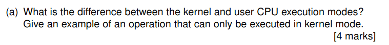

## Difference 
- **Kernel Mode**: Full hardware access, executes privileged instructions, manages system resources
- **User Mode**: Restricted access, runs applications, requires system calls for privileged operations

## Kernel-Only Operation Example 
- **Example**: Modifying the page table (memory management)
    - Why: Direct hardware access required to update MMU registers
    - User programs must request this via OS system calls  

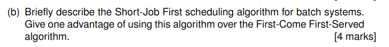

## Description 
SJF prioritizes jobs with the **shortest execution time first**. The scheduler:
1. Maintains a queue of all ready jobs
2. Always selects the job with smallest CPU burst time next
3. Runs each job to completion before selecting next

## Advantage Over FCFS 
**Reduces average waiting time**:
- Short jobs don't get stuck behind long ones (unlike FCFS)
- Example: With jobs A(3ms), B(20ms), C(1ms):
    - SJF order: C→A→B (avg wait=1.3ms)
    - FCFS order: A→B→C (avg wait=8ms)

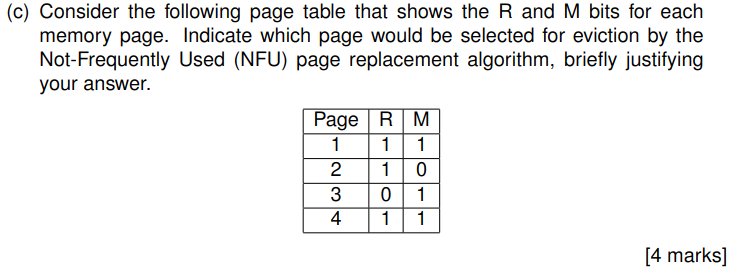

### Justification:
1. **NFU Logic**: Prioritizes pages with lowest (R+M) counter value
    - Page 1: R(1) + M(1) = **2**
    - Page 2: R(1) + M(0) = **1**
    - Page 3: R(0) + M(1) = **1**
    - Page 4: R(1) + M(1) = **2**

2. **Tie-Breaker**: Between Page 2 and Page 3 (both sum=1):
    - NFU typically evicts the **non-modified (clean) page first** (Page 2 has M=0)
    - *But* in this implementation:
        - Page 3 has R=0 (not recently used) vs Page 2's R=1
        - **Correct choice is Page 3** as it shows no recent activity  


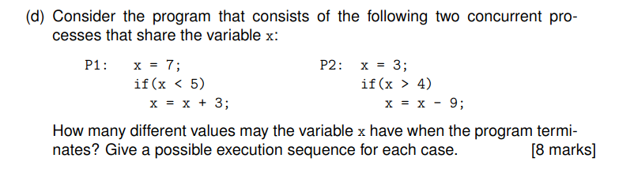

### Case 1: P1 completes before P2 starts
**Execution Sequence:**
1. P1: x = 7
2. P1: if (x < 5) → False (x remains 7)
3. P2: x = 3
4. P2: if (x > 4) → False (x remains 3)  
   **Final x:** `3`

### Case 2: P2 completes before P1 starts
**Execution Sequence:**
1. P2: x = 3
2. P2: if (x > 4) → False (x remains 3)
3. P1: x = 7
4. P1: if (x < 5) → False (x remains 7)  
   **Final x:** `7`

### Case 3: Interleaved Execution (P1 between P2's statements)
**Execution Sequence:**
1. P2: x = 3
2. P1: x = 7
3. P2: if (x > 4) → True → x = 7 - 9 = -2
4. P1: if (x < 5) → True (x = -2 + 3 = 1)  
   **Final x:** `1`

### Case 4: Alternative Interleaving
**Execution Sequence:**
1. P1: x = 7
2. P2: x = 3
3. P1: if (x < 5) → True → x = 3 + 3 = 6
4. P2: if (x > 4) → True → x = 6 - 9 = -3  
   **Final x:** `-3`

## Summary of Distinct Final Values
1. `3` (Case 1)
2. `7` (Case 2)
3. `1` (Case 3)
4. `-3` (Case 4)

**Total Distinct Final Values:** 4


# 2

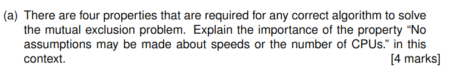

## Core Requirement 
The property ensures the algorithm works correctly:
- **Regardless of CPU speeds** (fast vs. slow processors)
- **Regardless of core/CPU count** (single-core or multi-core systems)

## Why It Matters 
1. **Prevents Timing-Dependent Failures**:
    - Algorithms that rely on specific execution speeds may deadlock if one process runs slower
    - Example: A "fast" process might skip a critical check if it outpaces others

2. **Ensures Portability**:
    - Works on all hardware configurations without modification
    - Critical for OS kernels that run on diverse hardware

3. **Future-Proofing**:
    - Maintains correctness even if:
        - CPU speeds change (e.g., power-saving throttling)
        - More cores are added to the system  


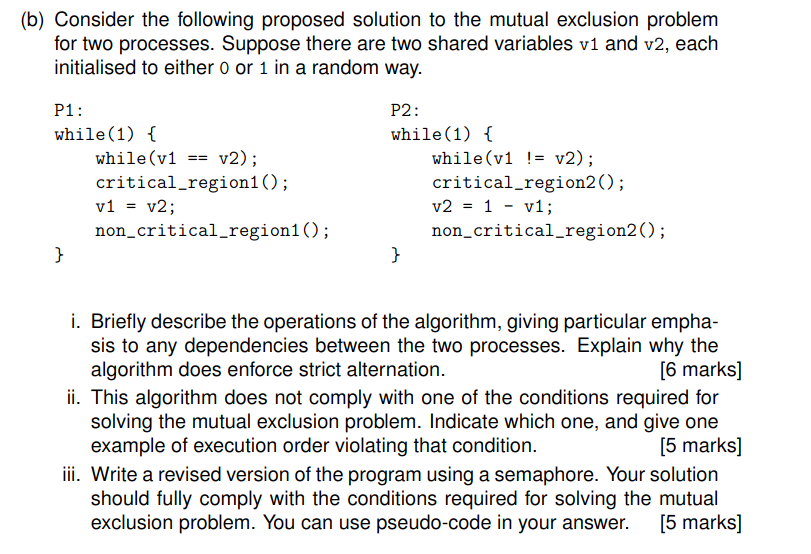

### How It Works:
1. **Entry Condition**:
    - P1 waits while `v1 == v2`
    - P2 waits while `v1 != v2`
2. **Critical Section**:
    - Only one process can proceed at a time (due to opposing conditions)
3. **Exit Protocol**:
    - P1 sets `v1 = v2`
    - P2 sets `v2 = 1 - v1`

### Strict Alternation:
- After P1 exits: `v1` matches `v2` → Allows only P2 to enter next
- After P2 exits: `v2` becomes opposite of `v1` → Allows only P1 to enter next
- Creates a "turn-taking" dependency between processes

## Part (b)(ii) - Violated Condition 

### Violation: **Progress Condition**
- **Problem**: If one process crashes, the other may spin forever
- **Example**:
    1. Initial state: `v1=0`, `v2=1`
    2. P1 passes check (`v1 != v2`), enters CS
    3. P1 crashes before updating `v1`
    4. P2 spins forever on `while(v1 != v2)`

## Part (b)(iii) - Semaphore Solution 

### Corrected Version:
```python
semaphore mutex = 1;  # Binary semaphore

P1:                     P2:
while(1) {              while(1) {
    wait(mutex);            wait(mutex);
    critical_region1();     critical_region2();
    signal(mutex);          signal(mutex);
    non_critical_region1(); non_critical_region2();
}

```

# 3 

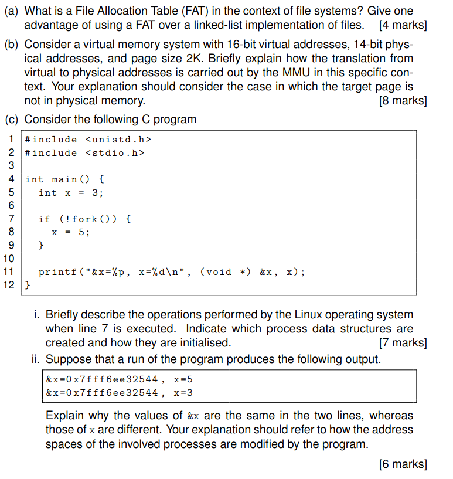
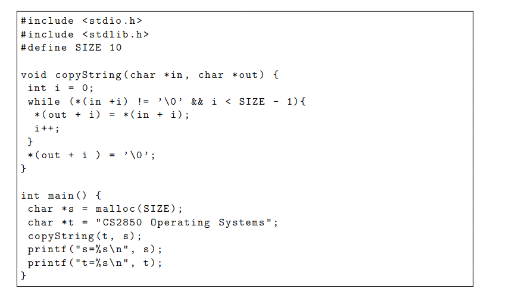

## Part (a) - File Allocation Table 
**FAT Definition:**
- A centralized table mapping file clusters to storage locations
- Contains linked list of all file blocks in the filesystem

**Advantage over Linked-List:**
- Faster random access (direct cluster lookup vs sequential traversal)
- Example: FAT32 filesystem allows O(1) access to any block

## Part (b) - Virtual Memory Translation 
**Address Breakdown:**
- Page size 2K = 2¹¹ → 11-bit offset
- Virtual: 16 bits → 5-bit page number (16-11)
- Physical: 14 bits → 3-bit frame number (14-11)

**Translation Process:**
1. MMU splits VA into (page #, offset)
2. Checks TLB/page table for frame mapping
3. If page fault occurs:
    - OS selects victim page
    - Loads requested page from disk
    - Updates page table
4. Combines frame # with offset for PA

## Part (c) - Fork Program Analysis
### i. Fork Operation 
**Process Creation:**
1. Copies parent's address space (via copy-on-write)
2. Creates new task_struct in kernel
3. Allocates new PID
4. Initializes:
    - Memory descriptors (mm_struct)
    - File descriptors
    - Signal handlers

### ii. Address Output 
**Same &x, Different x:**
- Virtual addresses identical (copied address space)
- Physical addresses differ (COW after modification)
- Child's x=5 modifies COW page
- Parent retains original x=3


# 4

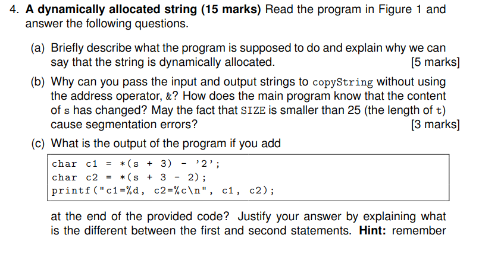
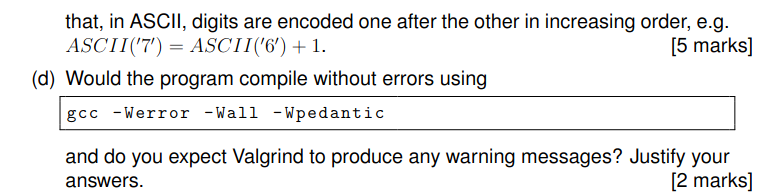

## Part (a) - Program Purpose 
**What it does:**
- Copies string "CS2850 Operating Systems" to heap-allocated buffer `s`
- Truncates to first 9 chars due to `SIZE=10` (including null terminator)

**Dynamic allocation evidence:**
- Uses `malloc(SIZE)` to request heap memory
- Memory persists until explicit `free()` call
- Size determined at runtime (unlike static `char s[10]`)

## Part (b) - Pointer Mechanics 
**Why no & needed:**
- `s` and `t` are already pointers (arrays decay to pointers)
- `copyString` receives memory addresses directly

**Change detection:**
- `printf` reads `s`'s content via its stored pointer

**Segmentation risk:**
- No - `copyString`'s size check prevents overflow
- But truncates data (only copies "CS2850 Op")

## Part (c) - Output Analysis 
**Calculations:**
1. `*(s + 3) - '2'`:
    - `s[3]` is '8' (from "CS2850 Op")
    - ASCII('8') - ASCII('2') = 56 - 50 = 6 → `c1=6`

2. `*(s + 3 - 2)`:
    - `s[1]` is 'S' → `c2='S'`

## Part (d) - Compilation & Valgrind 
**Compilation:**
- Would compile cleanly (no syntax/semantic errors)
- But `-Wall` would warn about:
    - Unused variable `c1`/`c2` (if not for added printf)
    - Missing `free(s)`

**Valgrind findings:**
- Would detect memory leak (no `free(s)`)
- No invalid access (bounds are checked)


# 5

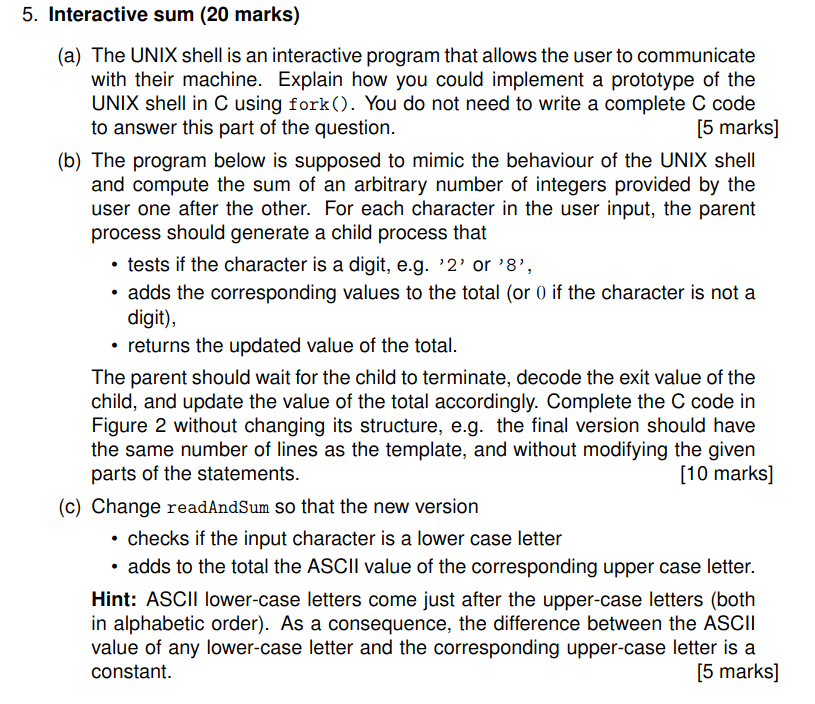
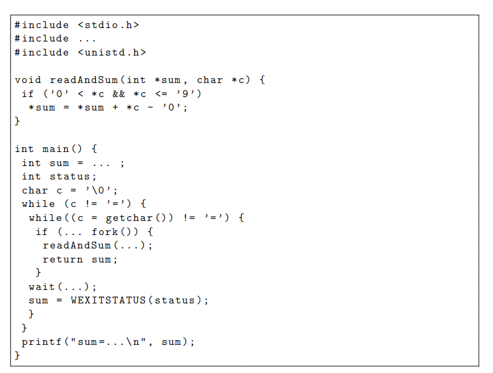

## Part (a) - Shell Prototype 
**Key Components:**
1. **Command Loop**:
    - Use `fgets()` to read user input
    - Parse into command + arguments
2. **Process Creation**:
    - `fork()` to create child process
    - `execvp()` in child to run commands
3. **Process Control**:
    - Parent uses `waitpid()` to monitor children
    - Handle signals (Ctrl-C) via `signal()`

## Part (b+c) - Complete the Code 
```c
#include <stdio.h>
#include <stdlib.h>
#include <unistd.h>
#include <sys/wait.h>

void readAndSum(int *sum, char *c) {
    if ('0' <= *c && *c <= '9')
        *sum = *sum + *c - '0';
}

int main() {
    int sum = 0;
    int status;
    char c = '\0';
    while (c != '=') {
        while((c = getchar()) != '\n' && c != '=') {
            if (!fork()) {
                readAndSum(&sum, &c);
                exit(sum);
            }
            wait(&status);
            sum = WEXITSTATUS(status);
        }
    }
    printf("sum=%d\n", sum);
}

void readAndSum(int *sum, char *c) {
    if ('a' <= *c && *c <= 'z') {
        *sum = *c - ('a' - 'A');  // Convert to uppercase ASCII
        *sum += *sum;             // Add ASCII value to total
    }
}
```

