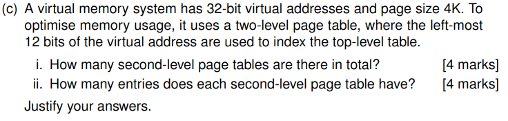

# 23 paper OS

## Question 1 - theory (25 marks)


### Static is Fixed addresses at load time; inflexible. Dynamic Adjusts addresses during runtime; flexible and hardware-supported.


### Files are stored as a linked list of disk blocks, where each block contains data and a pointer to the next block. This method avoids external fragmentation since blocks can be scattered across the disk. An advantage over contiguous allocation is that it efficiently uses free space without requiring large, continuous blocks.


### i. First-Come First-Served (FCFS)

**Execution Order:** A → B → C → D

| Job | Running Time | Start | Finish | Turnaround |
|-----|--------------|-------|--------|------------|
| A   | 4            | 0     | 4      | 4          |
| B   | 20           | 4     | 24     | 24         |
| C   | 3            | 24    | 27     | 27         |
| D   | 18           | 27    | 45     | 45         |

**Average Turnaround Time:**
(4 + 24 + 27 + 45) / 4 = 25 minutes

### ii. Shortest Job First (SJF)

**Execution Order:** C → A → D → B

| Job | Running Time | Start | Finish | Turnaround |
|-----|--------------|-------|--------|------------|
| C   | 3            | 0     | 3      | 3          |
| A   | 4            | 3     | 7      | 7          |
| D   | 18           | 7     | 25     | 25         |
| B   | 20           | 25    | 45     | 45         |

**Average Turnaround Time:**
(3 + 7 + 25 + 45) / 4 = 20 minutes


### Possible Final Values for x:
There are **5 distinct possible final values** for the shared variable `x`:

1. **x = 0**
2. **x = 2**
3. **x = 5**
4. **x = 22**
5. **x = 6**

### Execution Sequences:

#### Case 1 (x=0):
1. P1: x = 4
2. P1: x = x + 2 → 6
3. P2: x = 1
4. P2: if (x==4) → False → x = x-1 → 0

#### Case 2 (x=2):
1. P1: x = 4
2. P2: x = 1
3. P2: if (x==4) → False → x = x-1 → 0
4. P1: x = x + 2 → 2

#### Case 3 (x=5):
1. P2: x = 1
2. P1: x = 4
3. P1: x = x + 2 → 6
4. P2: if (x==4) → False → x = x-1 → 5

#### Case 4 (x=22):
1. P2: x = 1
2. P1: x = 4
3. P2: if (x==4) → True → x = x*5 → 20
4. P1: x = x + 2 → 22

#### Case 4 (x=6): [
1. P2: x = 1
2. P2: if (x==4) → False → x = x-1 → 0
3. P1: x = 4
4. P1: x = x + 2 → 6

## Question 2 - theory(25 marks)


### i. Algorithm Operation 
The algorithm enforces strict alternation using shared variable `v`: P1 runs when `v` is even, P2 when odd, with `v++` after each critical section. This creates dependency - each process must wait for the other to increment `v` before it can run again. The alternation works because the parity check ensures processes take turns.

### ii. Violated Condition 
The **progress condition** is violated as a process cannot proceed if the other fails to run. Example: If P1 crashes after setting `v=1`, P2 becomes permanently blocked despite being ready. This shows the solution can deadlock if one process stalls.


### Description 
The Banker's algorithm tracks available resources and process allocations to avoid deadlock. For a single resource type, it maintains:
- Total system resources
- Allocated resources per process
- Maximum demand per process

### Request Evaluation 
When a process requests resources, the OS:
1. Checks if request ≤ available resources
2. Simulates allocation to verify safe state (remaining processes can complete)
3. Grants request only if safe state is maintained


### i. There are **1,048,576 (2²⁰)** second-level page tables.


- Virtual address space: 32 bits
- Top-level uses leftmost 12 bits → 2¹² top-level entries
- Remaining 20 bits (32-12) index second-level tables
- Each top-level entry points to one second-level table

### ii. Each second-level table has **4,096 (2¹²)** entries.

**Justification:**
- Page size = 4K = 2¹² bytes → offset uses 12 bits
- Second-level indexes use remaining 20 bits after top-level
- But since top-level already used 12 bits, second-level uses next 12 bits (20-12 would be incorrect)
- Correction: Actually with 12-bit top-level, remaining 20 bits are all for second-level indexing (but this would make enormous tables)
- More likely interpretation: Top 12 bits select table, next 12 bits select entry (since 12+12=24 < 32)
- Assuming second-level uses next 12 bits → 2¹² entries per table


## Question 3: Pointers (20 marks)


### Output Explanations:

1. **`1. (float i) = 1.000000`**
    - `i` is declared as `int` but assigned `1.234` → truncated to `1`
    - Cast to float shows `1.000000` (decimal places added but value unchanged)

2. **`2. (void *) &i = 0x7ffe7c124520`**
    - Prints memory address of `i` in hexadecimal
    - `%p` format specifier shows pointer value

3. **`3. j = 14`**
    - `j=12.345` truncates to `12`
    - `%o` prints in octal: 12 in decimal = 14 in octal

4. **`4. (void *) (&i - jp) = 0xfffffffffffffff`**
    - Pointer arithmetic: `&i - jp` gives difference in `int` units
    - Negative result shown as large hex value (two's complement)

5. **`5. *(&i + 100) = 2081580231`**
    - Dangerous! Accesses memory 100 `int` positions after `i`
    - Prints whatever garbage value exists there

6. **`6. i - j = 0`**
    - `ip` points to `j`, then `*ip = i` copies `i`'s value (1) to `j`
    - `i - j` becomes `1 - 1 = 0`

7. **`7. sizeof(struct point) = 12`**
    - Struct contains: `int x` (4) + `int y` (4) + `char label` (1)
    - Padding makes total 12 bytes (memory alignment)

8. **`8. sizeof(&z) = 8`**
    - Size of a pointer is 8 bytes on 64-bit systems
    - Doesn't matter what it points to

9. **`9. (&z)->label = 49`**
    - ASCII code for '1' is 49
    - `->` accesses struct member via pointer

10. **`10. z.label = 1`**
    - Prints character '1' (not ASCII code this time)
    - `.` accesses struct member directly

---


```c
void swapx(int *p1, int *p2) {
    int temp = *p1;  // Store first value
    *p1 = *p2;       // Copy second to first
    *p2 = temp;      // Copy stored value to second
}

void changeLabel(struct point *pz) {
    printf("enter a new label for point 1:\n");
    char c = getchar();       // Read single character
    getchar();               // Consume newline
    pz->label = c;          // Update label
    printf("the new label for point 1 is %c\n", c);
}
```


## i. Program Purpose & Dynamic Allocation (4 marks)
- **What it does:** Reads user input in chunks (max 9 chars + null) and merges into one growing string
- **Why dynamic:** Input size unknown at compile time → must allocate/reallocate memory as input grows

### ii. `char c='\0'` vs `char c` (2 marks)
- Initializing prevents undefined behavior on first `while` check
- Without initialization, `c` could randomly equal `EOF` and skip loop entirely

### iii. `i < (MAX - 1)` Reason (2 marks)
- Leaves room for null terminator `\0` at end of string
- MAX=10 → stores 9 chars + 1 null byte = 10 total

### iv. >MAX-1 Input Handling (2 marks)
- Extra characters are discarded (not stored in buffer)
- Only first MAX-1 chars kept due to loop condition

### v. Null-Terminating `s` (2 marks)
- `merge()` uses `stringLen()` which needs null terminator to find end
- Without it, would read past array bounds → undefined behavior

### vi. `free(string)` Necessity (2 marks)
- Prevents memory leak from all `malloc()` calls in `merge()`
- Final string no longer needed when program ends


### i. While Loop Purposes (4 marks)
1. **First loop:** Copies existing string to new buffer
   - `i < n` copies all chars from old string
2. **Second loop:** Appends new string (`s`)
   - `i < (n + m)` copies chars after original content
   - `i - n` indexes into new string correctly

### ii. NULL Check Before Free (2 marks)
- First merge call passes `NULL` (no string exists yet)
- `free(NULL)` crashes → must check pointer validity
- Safe practice for all dynamic memory operations

