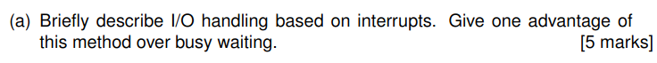

# CS2850 Operating Systems Exam Solutions

## 1. Theory Questions (25 marks)



### (a) Interrupt-based I/O handling (5 marks)
Interrupt-based I/O handling works by having the CPU issue an I/O command to a device and then continue executing other instructions without waiting for the I/O operation to complete. When the device completes the requested operation, it sends an interrupt signal to the CPU. The CPU then suspends its current execution, saves its state, and transfers control to an interrupt handler routine that processes the completed I/O operation.

**Advantage over busy waiting**: Interrupt-based I/O is more efficient than busy waiting because the CPU can perform useful work while waiting for the I/O operation to complete, rather than wasting CPU cycles by continuously checking the status of the I/O device.

### (b) Round Robin scheduling algorithm (9 marks)

#### i. How the algorithm works (3 marks)
The Round Robin scheduling algorithm works by:
1. Allocating a fixed time slice (quantum) to each process in a circular order
2. If a process completes within its quantum, it releases the CPU voluntarily
3. If a process does not complete within its quantum, it is preempted and placed at the end of the ready queue
4. The algorithm continues to execute processes in this circular fashion until all processes complete

#### ii. Scheduling example with quantum = 4ms (6 marks)

Initial state: Ready queue = [A(3ms), B(7ms), C(4ms), D(5ms)]

| Time | Running Process | Remaining Time | Action | Ready Queue After Action |
|------|----------------|----------------|--------|--------------------------|
| 0-3  | A              | 0              | Completes | [B(7), C(4), D(5)] |
| 3-7  | B              | 3              | Preempted | [C(4), D(5), B(3)] |
| 7-11 | C              | 0              | Completes | [D(5), B(3)] |
| 11-15 | D             | 1              | Preempted | [B(3), D(1)] |
| 15-18 | B             | 0              | Completes | [D(1)] |
| 18-19 | D             | 0              | Completes | [] |


### (c) Context switching for threads vs processes (3 marks)
Context switching is faster for threads than for processes when the threads belong to the same process. This is because threads within the same process share the same address space, memory mappings, file descriptors, and other process resources. When switching between threads, the operating system only needs to save and restore thread-specific information (like register values and stack pointers) while process context switching requires saving/restoring the entire memory management state, which is significantly more expensive.


### (d) Concurrent processes and final values of x (8 marks)
The program has two concurrent processes P1 and P2 that share variable x:

```
P1: x = 4;          P2: x = 2;
    if (x > 3) {        x = x * 2;
        x = x + 5;  }
    }               else {
                        x = x * 3;
                    }
```

Possible final values of x:

1. **Final value = 9**
  - P1: x = 4
  - P1: evaluates (x > 3) which is true
  - P2: x = 2 (overwrites x)
  - P1: x = x + 5 = 2 + 5 = 7
  - P2: evaluates (x > 3) which is true
  - P2: x = x * 2 = 7 * 2 = 14

2. **Final value = 14**
  - P1: x = 4
  - P2: x = 2 (overwrites x)
  - P2: evaluates (x > 3) which is false
  - P2: x = x * 3 = 2 * 3 = 6
  - P1: evaluates (x > 3) which is true
  - P1: x = x + 5 = 6 + 5 = 11

3. **Final value = 4**
  - P2: x = 2
  - P1: x = 4 (overwrites x)
  - P2: evaluates (x > 3) which is true
  - P2: x = x * 2 = 4 * 2 = 8
  - P1: evaluates (x > 3) which is true
  - P1: x = x + 5 = 8 + 5 = 13

4. **Final value = 13**
  - P2: x = 2
  - P2: evaluates (x > 3) which is false
  - P2: x = x * 3 = 2 * 3 = 6
  - P1: x = 4 (overwrites x)
  - P1: evaluates (x > 3) which is true
  - P1: x = x + 5 = 4 + 5 = 9

There are four possible final values: 9, 14, 11, and 13.

## 2. Theory Questions (25 marks)


### (a) Sleep and wakeup primitives (5 marks)
Sleep and wakeup primitives are synchronization mechanisms used in Inter-Process Communication:

- **Sleep**: When a process calls sleep(), it voluntarily blocks itself and is removed from the run queue. The process enters a waiting state until it is awakened by another process.

- **Wakeup**: When a process calls wakeup(process_id), it signals the process specified by process_id to resume execution. The sleeping process is moved from the waiting state back to the ready state.

**Advantage of semaphores**: Semaphores solve the "lost wakeup" problem that can occur with sleep/wakeup primitives. If a wakeup signal is sent to a process that is not yet sleeping (but about to sleep), the signal is lost, and the process might sleep indefinitely. Semaphores keep track of wakeup signals by maintaining a counter, ensuring signals aren't lost, which makes them more robust for synchronization.


### (b) Deadlock avoidance - safe vs unsafe states (6 marks)

For a state to be safe, there must exist a sequence in which all processes can complete without causing deadlock.

**State X**:
- Total resources: 10
- Currently allocated: 1 + 3 + 1 + 1 = 6
- Available resources: 10 - 6 = 4

To determine if State X is safe, we need to find a safe sequence:
1. Process C needs 2 resources max, already has 1, so needs 1 more. With 4 available, C can complete and release its 1 resource.
2. Now available: 4 + 1 = 5. Process D needs 5 resources max, already has 1, so needs 4 more. With 5 available, D can complete and release its 1 resource.
3. Now available: 5 + 1 = 6. Process A needs 8 resources max, already has 1, so needs 7 more. With only 6 available, A cannot complete.

State X is **unsafe** because we cannot find a sequence to safely complete all processes.

**State Y**:
- Total resources: 10
- Currently allocated: 2 + 2 + 3 + 1 = 8
- Available resources: 10 - 8 = 2

To determine if State Y is safe:
1. Process D needs 6 resources max, already has 1, so needs 5 more. With only 2 available, D cannot complete yet.
2. Process C needs 5 resources max, already has 3, so needs 2 more. With 2 available, C can complete and release its 3 resources.
3. Now available: 2 + 3 = 5. Process D can now complete (needs 5), releasing 1 resource.
4. Now available: 5 + 1 = 6. Process A needs 9 max, has 2, so needs 7 more. With only 6 available, A cannot complete.

State Y is also **unsafe**.


### (c) Ext4 i-nodes memory usage (4 marks)
In Ext4, i-nodes in memory are different from i-nodes on disk:
- Disk i-nodes: 256 bytes (as stated in the question)
- Memory i-nodes: Typically larger than disk i-nodes as they contain additional information needed by the kernel

The question states there are 200 open files, and only i-nodes for open files are kept in main memory.

Therefore, the total main memory usage for i-nodes is:
200 (open files) × 256 bytes (i-node size) = 51,200 bytes = 50 KB


### (d) Working Set page replacement algorithm (10 marks)

#### i. Pages in working set (4 marks)
The working set at virtual time 200ms with τ = 100ms includes all pages that have been accessed in the time interval [200-100, 200] = [100, 200].

- Page 1: Last used at 90ms, which is outside the interval [100, 200]. Not in working set.
- Page 2: Last used at 100ms, which is exactly at the boundary of the interval [100, 200]. In working set.
- Page 3: Last used at 30ms, which is outside the interval [100, 200]. Not in working set.
- Page 4: Last used at 50ms, which is outside the interval [100, 200]. Not in working set.

#### ii. Page eviction and table update (6 marks)
When selecting a page for eviction, the Working Set algorithm considers:
1. Pages not in the working set are evicted first
2. Among pages not in working set, the selection priority is:
  - R=0, M=0 (highest priority for eviction)
  - R=0, M=1
  - R=1, M=0
  - R=1, M=1 (lowest priority for eviction)

Pages not in the working set are 1, 3, and 4.

Among these:
- Page 1: R=1, M=0
- Page 3: R=1, M=1
- Page 4: R=0, M=1

Page 4 has R=0, M=1, which gives it higher priority for eviction than pages 1 and 3.

Therefore, Page 4 is selected for eviction.

After the page fault at time 200ms, the R bits for all pages would be reset to 0, and the time of last use for the page that caused the fault would be updated to 200ms.

## 3. Swap two characters (25 marks)


### (a) swapChar function (5 marks)
```c
void swapChar(char *c1, char *c2) {
    char temp = *c1;
    *c1 = *c2;
    *c2 = temp;
}
```

### (b) initializeString function (10 marks)
```c
char * initializeString(char *buf) {
    int length = 0;
    // Find length of input string
    while (buf[length] != '\0') {
        length++;
    }
    
    // Allocate memory for new string (including null terminator)
    char *newStr = (char *) malloc((length + 1) * sizeof(char));
    
    // Copy content of input string
    int i = 0;
    while (i < length) {
        newStr[i] = buf[i];
        i++;
    }
    
    // Null-terminate the new string
    newStr[length] = '\0';
    
    return newStr;
}
```

### (c) Complete main function (10 marks)
```c
int main() {
    char *buf = "CS2850";
    char *s = initializeString(buf);
    swapChar(&s[0], &s[1]);  // Swap 'C' and 'S'
    printf("s=%s\n", s);
    free(s);  // Free allocated memory to prevent leaks
    return 0;
}
```

## 4. A linked list of integers (25 marks)


### (a) Structure size and sizeof (5 marks)
The size of the structure depends on the system's architecture and compiler's alignment requirements. On a typical 64-bit system:
- int label: 4 bytes
- float value: 4 bytes
- struct node *next: 8 bytes (pointer size on 64-bit system)

However, due to padding and alignment, the total size might be larger than the sum of individual fields.

It's better to use sizeof instead of computing the sum of member sizes because:
1. Different architectures and compilers may have different sizes for primitive types
2. Compilers may add padding between structure members for alignment optimization
3. Using sizeof guarantees the correct size regardless of platform differences
4. The structure may change in the future, and sizeof will automatically reflect those changes

### (b) '\0' vs '0' and subtracting '0' (5 marks)
- '\0' is the null character with ASCII value 0
- '0' is the character zero with ASCII value 48 (in ASCII)

We subtract '0' in `new->value = c - '0'` to convert the ASCII value of a digit character to its numerical value. When c is a digit character (like '1', '2', etc.), subtracting '0' gives the corresponding integer value (1, 2, etc.). This is because the ASCII codes for digit characters are sequential, so subtracting the code for '0' gives the actual numerical value.

### (c) Node printing order and loop termination (5 marks)
The nodes are printed from last to first because of how the list is constructed. Each new node is added to the front of the list (prepended) with `new->next = head; head = new;`. This means that when we read input like "1423\n", the nodes are created in the order 1,4,2,3 but linked in reverse order: 3→2→4→1→NULL.

The second while loop ends after printing the node with label 0 because the loop condition is `while (head)`, which continues as long as head is not NULL. After processing the last node (the one with label 0), `head = head->next` sets head to NULL, causing the loop to terminate.

### (d) Dynamic allocations and free calls (5 marks)
The program performs one dynamic allocation (`malloc`) for each digit character entered by the user. If the user enters "1423\n", that's 4 digit characters, so 4 allocations are performed.

The program calls `free` exactly once for each allocated node, inside the second while loop. For the input "1423\n", it will call `free` 4 times, ensuring all allocated memory is properly released.

### (e) Output prediction (5 marks)
For the input "1423\n":

The program creates 4 nodes:
- Node for '3': label=0, value=3.0
- Node for '2': label=1, value=2.0
- Node for '4': label=2, value=4.0
- Node for '1': label=3, value=1.0

When printing and freeing nodes:
```
label=0, value=3.000000
i = i + 3.0 = 0 + 3 = 3

label=1, value=2.000000
i = i + 2.0 = 3 + 2 = 5

label=2, value=4.000000
i = i + 4.0 = 5 + 4 = 9

label=3, value=1.000000
i = i + 1.0 = 9 + 1 = 10
```

The final output would be `i=10`

However, the argument of printf is not entirely correct. We are adding floating-point values (`temp->value`) to an integer (`i`), and then using `%d` format specifier which expects an integer. This might cause truncation if the values had fractional parts, but in this case, all values are whole numbers so it works correctly.