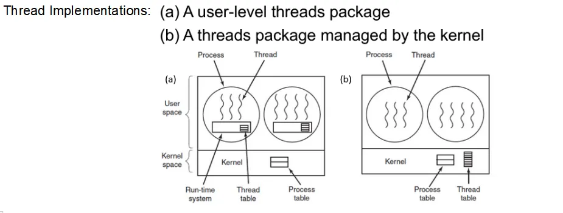
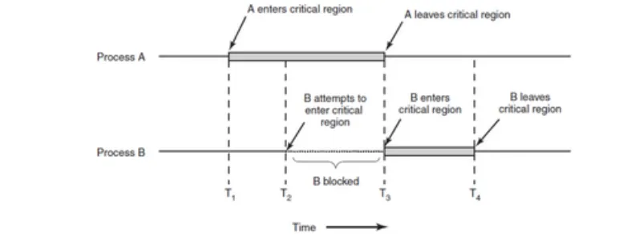

# Two modes of execution 

## Kernal  
    Allows all instrcutions and hardware usage 

## User
     Allows only a subset of instructions and features 

### Modern cpus use a pipeline to increase performence and scheduling 


## CPU performence has imporeved with techniques such as:

- Multithreading:    
    Allows different tasks to take place in a CPU which it can witch between , like when wating for a vlue from memory

- Multicore:
    CPUs have several cores, effectively being composed of several processors

- Specialsed proccesses
    GPUs(for example) are very good eith small computations in parallel 


# Memory 

- Not just one entity 
- Consists of a heirarchy of  layers
- top layers have high speedspeed, low levels have  high capacity 
- Commonly accessed data should be stored in faster memeory via a "process" this is known as caching 


    Registers           | < 1 KB
    Cache               | 4 MB
    Main Mmeory         | 1- 8 GB
    Magnetix Disk       | 1-4 TB


# i/O (input/output)
### Typically  consists of a controller and the device
     The controller is a hardware component that accepts commands from the OS- such as a SATA disk controller. Each controller is different so to minamize complexity, drivers are used (a sepcial type of software)

## I/O devices can take place is several places- such as busy waiting
 - a program issues a system call
 - the OS translates it to a call to the device driver 
 - the driver intiates the I/O and continously polls thr device to check if it has completed the operation.
 - once that is done, it returns any result and the OS passes it to the original caller


    Main advanatge is that the CPU is tied up during the polling process

## Interupt processing 

    Involves taking the interupt , running thr handler and returning it to the user program 


# Processes 

A processes is associated with an address space and  set of resources 

 - process Tree : Processes A craeted two children processes, B and C. Process B created three child processes, D, E and F


         A
        / \
       /   \
      B     C
     /|\
    / | \
    D  E  F


## Mounting in UNIX

    a) before mounting, the files on the CD-ROM are not accessible.
    b) After mmounting, they are part of the file heirachy 


    File System Hierarchy            CD-ROM
     /                              _______
    /|\                            /       \
    / | \                         |  data1  |
    /  |  \                       |  data2  |
    bin etc home                  |  music  |
                                  |_________/

    (CD-ROM files not accessible)

                File System Hierarchy
                    /
                   /|\
                  / | \
                 /  |  \
               bin etc home
                        |
                        |
                     /mount
                       /
                      /\
                     /  \
                    /    \
                 data1  data2
                         |
                       music

    (CD-ROM files now accessible through the file hierarchy)


### Processes can be connected via a pipe
     A ------- B
### OS's genrally keep the follwoing infomation:
- Process ID
- Proccess name
- User running the program 
- Excetutable file associated with the process 
- current values of the reigisters, varibles and program counter


### In multiprogramming systems, CPU's quickly switch from rpocess to process , this gives an illusion od parallelsim (pseudo-paralleslism), even with just one CPU


    conceptual model of four independent, sequential processes       |        The physical reality
    
                                                                              One program counter
    Four program counters                                                              |
            |                                                                   +------v------+
            v                                                                   |     →  A    | Process
    +---+---+---+---+                                                           |    ↙        | switch
    |   |   |   |   |                                                           |     →  B    |
    v   v   v   v   v                                                           |    ↙       |
    +---+---+---+---+                                                           |     C      |
    | A | B | C | D |                                                           |     ↓      |
    | ↓ | ↓ | ↓ | ↓ |                                                           |    ↙       |
    +---+---+---+---+                                                           |     →  D    |
                                                                                +-------------+
    
    Only one program is active at once in a single CPU
    
    Process
    ^
    |
    D  ___       ___
    |
    C       ___       ___
    |
    B  ___       ___
    |
    A  ___       ___
    +-------------------------->
    Time


### main events that cause proccesses to be created:
- System intialisation 
- execution of a process creation system call by a running process 
- a user request to create a new proccess 
- intitation of a batch job


## Posix Os's (UNIX, Linux, OS X, etc), a new process is created via one system call: fork
- a clone of the calling process is created
- parent and child proccesses use an identical copy of the memory image, the same enviorment values and the same open resources 
- however, the address space is seperate 

## Fork()
- not only creates a new process but returns twice 
- in the parent process it returns the child process ID
- in the child process it returns zero.
- codebase for both processes will be the same up untill the fork is called. the child process after can change the memory image and run a new program

## Process termination:
- normal exit (voluntary)
- Error exit (voluntary)
- Fatal error (involuntary)
- killed by another process (involuntary)

#### Some proccesses interact directly with users , independatly of how they started (file explorer for  example). Others work in the background and react to certain occurances. These are known as daemons. This could be a process that checks for OS updates.

#### The lowest layer, scheduler, of a process-structured OS handles interupts and scheduling. Above that layer are sequential proccesses.

# Threads

##  Having parallelism whilst sharing an address space can also be beneficial; a thread is a componenet of a process
- Creating a proccess carries an overhead  which is significantly higher than for creating a thread
- Context switching between threads is also faster 
- shaing address space makes it easier to write code that deals with several activities that can block at certain points need to interact

### So,  3 threads in one process is a lot more memory efficent and faster than having 3 proccesses . they exist in the user space and share memeory address space 





### With user implemenattion fo threads, the kernal is not aware of them

#### Advantages:

- Can be implemented on OS's with no no thread support
- Context switching is fairly simple and fast and this is done with local calls only
- Scheduling algorithms can be cutsomized to processes 

#### Disadvancages:

- Blocking system calls affect all the threads in the process 
- relies on threads voluntarily giving up the CPU
- Many reasons for using threads are based on taking advantage  of blocking calls

### With kernal level threads, the kernal keeps a list of threads just as it keeps a list of proccesses 

#### Advanatges 

- Blocking systems calls can be used transparently 
- new non-blocking  system calls are not required 
- page fault caused by one thread do not affect others

#### Disadvantages 

- System calls are costly 
- multithreaded process fork semantics 
- Signal handling- which thread takes a signal?


# IPC


## Proccesses need to be able to communicate to:
- pass infomation which is relevent for a given multi-process task 
- prevent  trying to access exclsuive resources simultaneously 
- work with an appropriate sequenceing of events when there are dependencies 

## Threads share memory, hence they can communicate that way, but, they can also:
- Prevent trying to access exclsuive resoucres simultaneosuly 
- work with an appropriate sequencing of events when there are dependencies 


## Race conditions 

### Even some processes can share common storage; this creates the potential for issues when they change somthing in that storage.

### A race condition is said to take place when two or more proccesses are reading or writing some shared data and the final result depends on who runs precisly when.

### Parallemism has many benefits, but it futher increases the chance of race conditions; debugging this can be hard

## Mutual exclusion 

### a technique commonly used to avoid race conditions; if a process is using a shared resource, other processes are excluded from doing the same.

### Onw way to achieve this is by identifying the parts of the program , critical regions , where processes access shared resources and making sure that two or more processes are not in their critical regions at the same time.

### A "good" Solution to race conditions should satisfy thre follwoing requirements:
- No two processes may be simuultaneously inside their critical regions 
- no assumptions may be made about speeds or the number of CPU's
- no process running outside its critical region may block other proccesses 
- no proccesses should have to wait forever to enter its critical region




## Proposals/solutuions:


### Proposals and solutions 

- IPC with busy waiitng, Software and hardware solutions 
- IPC without busy waiting, semaphores, monitors


### IPC with busy waiitng 

#### using mutual exclussion 

- while one process is working on shared memory in its critical region, other proccesses will not enter their critical regions. These proccesses will keep checking a certian condition such as the value of a varible to determine if they can enter the critical region or not.

### lock varible,
    create a varible (lock) intially set to 0. before a process enters its ciritial region, it will inspects the lock. if 0, it will change to 1 and eneter the critial region . if already 1, wait untill its 0 to enter.

### The problem 
    - process A reads the lock as 0
    - Process B is scheduled before A can set it to 1
    - process b reads it as 0
    - both processes eneter their critical regions 

### Petersons solution 
- works for two proccesses P0 and P1
- Critical region control:


    Enter_region(process);
    critial_region();
    leave_region(process);


## Hardware solutions 

### Disable interrupts when entering a critical region
- simple solution 
- Requires a lot of power given to process 
- if there is a bug in the process it may never enable interupts 
- does not work for multiprocessor systems 


### The TSL instruction 

#### CPU designers can provide CPU instuctions that do several actions at a time. Each CPU instrcution is atomic and no interupt can occur while the instrcution is running.
#### TSL instructions allow us to construct a safe verison of a lock.

### Solutions involving hardware routines are simple and very easy to verify. work for any number of proccesses at no extra cost. BUt this still involvs busy waiting.

### The problem with busy waiting:
- CPU time is wasted on checks 
- Busy waiting can lead to priority inversion problem.


     Consider two processes, H with high priority and L with low priority 
     L is in the critical region
     H will waiting to enetr its critical region 
     H will waste CPU time cehcking whether it can enter the critical region and will not let L to do the work and vacate the critical region
     If priority of H is so high that L cannot run at all while H is running, this creates a deadlock; H will never enter its critical region


## IPC without busy waiting 

#### While one process is updating shared  memory in its critical region, no other process will enter its critical region as it will be blocked.

### Sleep and Wakeup

- Sleep: susppends/blocks current process
- Wakeup: takes one process id as a paramter, namely the process to be awakend 
#### A sleeping process does not waste CPU time.

### The producer-consumer problem  does not waste  CPU time.

#### Two proccesses communicate through a common fixed-size buffer. One puts information in and the other reads it and takes it out

#### If the producer has a new item to add but is already full, then we should make it go to sleep and be awakend when there is space in buffer.


## Semaphores 

### A sepcial type of variable

- record number of wakeup calls
- allows for two main operations 

        down:
        If the number of wakeup calls is 0, puts the calling process to sleep before completing the operation
        otherwise it deceremnts the number and allows the process to proceed.

        Up:
        Increments the number of wakeup calls
        If there were processes sleeping due to the down operation, one will be woken up and allowed to complete down.

#### The up and down operations work without themsleves creating race conditions 

- Checking the value of the semaphore, and deciding if a process needs to enter sleep state is an atomic operation
- once a semaphore operation starts, no other process can access it untill the operation completed or blocked a process as a result of the original call.


#### Normally up and down  are implimented as system calls where:
- the OS briefly disables interrupts
- in a multiple CPU scenario, it is nesessary to protect the semaphores with lock varribles using TSL or XCHG. This emans there will eb soem busy waiitng, but its minimal, rather than the whole critical region.


#### Semaphores can be used for:
- mutual exclusion(protect critical region)
- Synchronisation(preven a force or central sequence of events)
- Binary semaphores only has 2 values (0 and 1) and is used for mutual exclussion.


## Mutex 

### A simplified semaphore which still ensures mutual exclussion.

- Only two states: locked/unlocked
- This simplicity results in efficeency 
- Requesting access to a critical region involves calling mutex_lock (works as down in semaphores)
- When exiting the critical region a thread calls mutex_unlock(works as up in semaphores.) releases current blocked proccesses but no count i kept.

## Monitors 

- Programming with semaphores is very hard
- the cocnept of monitors was introduced in order to overcome some of these difficulties
- a monitor is a collection of procedcures, varibles and data structures, grouped in a moudle. 
- Proccesses can call the procedures in a monitor as needed but cannot access its internal data structures 
- only one process can be active in a monitor at a given time(which ofcourse ensures mutual exclussion)
- monitors are programming langauge constructs so the compiler will generate the needed instrcutions  to achieve this
- critical regions can be turned into monitor procedcures to achieve mutual exclsuiion 

#### Only some progarmming lanaguegs offer this.
- C does not
- Java does-  a monitor can be implemented by creating a class that contains methods that use the keyword "synchronized"


## Message passing 

### Uses two systems calls:

#### Send (destination and message)
#### recieve (source and message)


## Barriers

### Some applications rely on phases
#### No process can move into the next phase  before all proccesses are ready to do so.
#### these phases are seperated by barriers 
#### a process arriving at a barrier is blocked untill all processes have reached the barrier, which works as a syncronisation mechansim.


## Dining Philosphers problem 

### Five philosophers are seated around a circuler table and each has a plate of spaghetti
### The spaghetti is so slippery that two forks are needed to eat it
### however: between each plate there is only one fork

#### These phiopshers only:
 
- eat
- think (and get hungry!)

##### When they are hungry they try to pick up the left and right forks, one time at a time, in either order.
##### If succesful, the philosopher will eat for a while, then put down the forks and go back to thinking

- solved if only one philosopher can eat at once but requres bianry semaphores


# Scheduling 

### Scheduling Algorithms

| Algorithm | Description | Advantages | Disadvantages |
|-----------|-------------|------------|---------------|
| First-Come, First-Served (FCFS) | Processes executed in arrival order | Simple implementation | "Convoy effect" (short processes wait for long ones) |
| Shortest Job First (SJF) | Selects process with shortest execution time | Optimal for minimizing average waiting time | Difficult to predict execution time |
| Round Robin (RR) | Each process gets a small time quantum | Good for time-sharing systems | Performance depends on quantum size |
| Priority Scheduling | Process with highest priority is selected | Flexible for different system needs | May cause starvation of low-priority processes |

### Performance Metrics
- **Turnaround Time**: Time from submission to completion
    - Formula: `Turnaround Time = Completion Time - Arrival Time`
- **Response Time**: Time from submission until first response
- **Throughput**: Number of processes completed per time unit
- **CPU Utilization**: Percentage of time CPU is working

### Scheduling with Batch Systems
- **Goal**: Maximize throughput, minimize turnaround time
- **Best algorithms**: FCFS, SJF, Priority scheduling

### Example: Round Robin Scheduling

Consider processes A, B, C, D with running times 3, 7, 4, and 5 ms respectively, and time quantum = 4ms:

| Time | 0-3 | 3-7 | 7-11 | 11-15 | 15-18 | 18-19 |
|------|-----|-----|------|-------|-------|-------|
| Process | A | B | C | D | B | D |
| Remaining | A: 0<br>B: 7<br>C: 4<br>D: 5 | A: 0<br>B: 3<br>C: 4<br>D: 5 | A: 0<br>B: 3<br>C: 0<br>D: 5 | A: 0<br>B: 3<br>C: 0<br>D: 1 | A: 0<br>B: 0<br>C: 0<br>D: 1 | A: 0<br>B: 0<br>C: 0<br>D: 0 |
| Queue | B,C,D | C,D,B | D,B | B,D | D | - |

**Completion order**: A (t=3), C (t=11), B (t=18), D (t=19)

### Example: Calculating Turnaround Times

For jobs A, B, C, D with running times 4, 20, 3, 18 minutes:

**FCFS (order A, B, C, D)**:

| Process | Start Time | Finish Time | Turnaround Time |
|---------|------------|-------------|-----------------|
| A | 0 | 4 | 4 |
| B | 4 | 24 | 20 |
| C | 24 | 27 | 27 |
| D | 27 | 45 | 45 |

Average turnaround time = (4 + 20 + 27 + 45) / 4 = 24

**SJF (reordered by length: C, A, D, B)**:

| Process | Start Time | Finish Time | Turnaround Time |
|---------|------------|-------------|-----------------|
| C | 0 | 3 | 3 |
| A | 3 | 7 | 7 |
| D | 7 | 25 | 25 |
| B | 25 | 45 | 45 |

Average turnaround time = (3 + 7 + 25 + 45) / 4 = 20

Types of Scheduling Environments
1. Batch Systems

Characteristics: Non-interactive, jobs are processed without user intervention
Goals: Maximize throughput, minimize turnaround time, CPU utilization
Examples: Payroll systems, scientific simulations

2. Interactive Systems

Characteristics: User is waiting for response, requires fast response time
Goals: Minimize response time, provide fairness
Examples: Desktop computers, time-sharing systems

3. Real-Time Systems

Characteristics: Time-critical operations, deadlines must be met
Goals: Meet deadlines, predictability
Types:

Hard real-time: Missing deadline is a system failure (aircraft control)
Soft real-time: Missing deadline degrades performance but system continues (multimedia)


Advanced Scheduling Algorithms
1. Guaranteed Scheduling

Concept: Each process guaranteed a certain percentage of CPU time
Implementation: Tracks CPU usage and allocates resources to meet guarantees
Use case: Systems with service level agreements

2. Lottery Scheduling

Concept: Processes receive lottery tickets, scheduler holds random drawing
Characteristics:

Probabilistic fairness
Easy to implement
Flexible priority system through ticket allocation


3. Fair Share Scheduling

Concept: CPU time divided among users or groups rather than processes
Characteristics:

Prevents a single user from monopolizing resources
Hierarchical resource allocation
Used in multi-user systems


Policy vs. Mechanism
Policy

Definition: High-level decisions about how the system should behave
Examples: Which process to run next, how much CPU time to allocate
Characteristics: Often dynamic and adaptable

Mechanism

Definition: Implementation details of how policies are enforced
Examples: Context switching, dispatching, timer interrupts
Characteristics: Typically fixed, independent of policy

Separation of Policy and Mechanism:

Allows changing policies without altering mechanisms
Increases flexibility and adaptability
Key principle in modern OS design

Thread Scheduling
Process vs. Thread Scheduling

Process scheduling: Allocating CPU to different processes
Thread scheduling: Allocating CPU to threads within processes

Thread Scheduling Approaches
1. User-Level Threads

Characteristics:

OS sees only the process, not individual threads
Thread library handles scheduling
Fast context switching
Cannot take advantage of multiprocessing


2. Kernel-Level Threads

Characteristics:

OS schedules individual threads
Can utilize multiple CPUs
More overhead for context switching
OS can make intelligent scheduling decisions


3. Mixed Approaches (M Threading)

Characteristics:

Maps M user-level threads to N kernel-level threads
Combines advantages of both approaches
More complex implementation


Thread Scheduling Considerations

Contention scope:

Process contention scope (PCS): Competition among threads within a process
System contention scope (SCS): Competition among all threads in the system


Processor affinity:

Tendency to keep a thread running on the same processor
Improves cache performance
Types: soft affinity and hard affinity


Memory Considerations in Scheduling
1. Working Set Model

Set of pages a process needs in RAM to execute efficiently
Scheduling decisions consider memory constraints

2. Thrashing

Excessive paging causing severe performance degradation
Scheduling can prevent thrashing by limiting concurrent processes

3. Memory-Aware Scheduling

Considers both CPU and memory requirements
Balances CPU utilization with memory constraints

Admission Scheduling

Definition: Determines whether to accept new processes into the system
Purpose: Prevents system overload
Considerations:

Current system load
Resource requirements of new process
Performance guarantees


Admission Control Strategies

Resource-based: Admit if sufficient resources available
Performance-based: Admit if performance targets can still be met
Priority-based: Higher priority processes admitted over lower priority

Multiprocessor Scheduling
1. Load Balancing

Distribution of processes across multiple processors
Goals: maximize throughput, minimize response time

2. Processor Affinity

Keeping a process on the same processor
Types: soft affinity and hard affinity

3. Gang Scheduling

Group of related threads scheduled to run simultaneously
Important for parallel applications with communication

Real-World Examples
1. Linux CFS (Completely Fair Scheduler)

Based on fair queuing algorithm
Uses red-black tree to track processes
Virtual runtime determines next process to run

2. Windows Thread Scheduler

Priority-based preemptive scheduling
Dynamic priority boosting
Processor affinity support

3. Real-Time Operating Systems (RTOS)

Rate Monotonic Scheduling: Fixed priorities based on periods
Earliest Deadline First: Dynamic priorities based on deadlines


# Memory Managment 

# Operating System Memory Management Guide

## Introduction to Memory Management

Memory management is a critical function of operating systems that controls and coordinates computer memory, allocating portions to programs when needed and freeing it for reuse when no longer required. Effective memory management is essential for system performance and stability.

## Memory Management Without Abstraction

### No Memory Abstraction

In the simplest approach, programs directly access physical memory without any OS abstraction layer.

- **Characteristics**:
    - Programs access raw physical memory addresses
    - No protection between programs
    - Programs must manage their own memory allocation
    - Common in early computers and some embedded systems

- **Limitations**:
    - Programs need to know physical memory layout
    - Multiple programs can interfere with each other
    - Difficult to relocate programs once loaded

## Basic Memory Management Techniques

### Swapping

- **Definition**: The process of temporarily moving entire processes from main memory to a backing store (disk) and vice versa
- **Purpose**: Allows running more and larger programs than would fit in physical memory
- **Operation**:
    1. OS moves inactive process from memory to disk
    2. OS loads waiting process from disk to memory
    3. Process execution resumes

- **Advantages**:
    - Enables multitasking with limited physical memory
    - Simple conceptually

- **Disadvantages**:
    - High overhead due to moving entire processes
    - Slow due to disk I/O
    - Address binding complications

### Static Relocation

- **Definition**: Adjusting memory addresses at load time, before execution begins
- **Process**:
    1. Compiler generates code with addresses starting at zero
    2. Loader modifies addresses when program is loaded based on starting location
    3. Once loaded, addresses remain fixed

- **Limitations**:
    - Cannot move program once execution begins
    - Fragmentation becomes an issue
    - Relocation must be done again if program is moved

### Dynamic Relocation

- **Definition**: Translating logical addresses to physical addresses at runtime
- **Implementation**: Uses hardware support (MMU - Memory Management Unit)
- **Benefits**:
    - Programs can be moved during execution
    - Enables more flexible memory management
    - Supports virtual memory

## Memory Abstraction

### Address Spaces

- **Logical Address Space**: The set of addresses a program can use (program's view)
- **Physical Address Space**: Actual physical memory addresses

- **Benefits of Address Space Abstraction**:
    - Programs can be written without knowledge of physical memory layout
    - Programs can be relocated in physical memory
    - Programs are isolated from each other
    - Can exceed physical memory size (with virtual memory)

### Base and Limit Registers

- **Purpose**: Simple hardware mechanism to implement memory protection and relocation
- **Components**:
    - **Base Register**: Contains starting physical address of the process
    - **Limit Register**: Contains size of the process

- **Operation**:
    1. CPU generates logical address
    2. MMU adds base register value to logical address to get physical address
    3. MMU checks if address is within limits (base to base+limit)
    4. If within limits, access proceeds; if not, trap occurs

- **Example**:
    - Base Register = 14000
    - Limit Register = 8000
    - Logical Address = 3000
    - Physical Address = 14000 + 3000 = 17000

- **Protection**:
    - Process can only access memory between base and base+limit
    - Any attempt to access memory outside this range generates trap

## Memory Allocation Management

### Memory Allocation Tracking Techniques

#### Bitmaps

- **Definition**: Array of bits where each bit represents a fixed-size block of memory
- **Convention**:
    - 0 = block is free
    - 1 = block is allocated

- **Example**:
  ```
  Bitmap: 0011000110000001
  ```
    - Blocks 2-3, 7-8, and 15 are allocated
    - All other blocks are free

- **Advantages**:
    - Simple to implement
    - Easy to find status of any block

- **Disadvantages**:
    - Inefficient for finding runs of free blocks
    - Size of bitmap depends on memory size and allocation unit

#### Linked Lists

- **Definition**: Track free and allocated memory regions using linked list structures
- **Node structure**: (address, size, status, next)
- **Operations**:
    - Finding free blocks
    - Allocating memory
    - Freeing memory
    - Coalescing adjacent free blocks

- **Advantages**:
    - Efficient for finding runs of free blocks
    - Easy coalescing of adjacent free blocks

- **Disadvantages**:
    - More complex than bitmaps
    - Overhead of maintaining list structures

## Memory Allocation Algorithms

### First Fit

- **Algorithm**: Scan memory from beginning and use first free block that's large enough
- **Advantages**:
    - Fast allocation time
    - Simple implementation
- **Disadvantages**:
    - Tends to fragment memory at the beginning

### Best Fit

- **Algorithm**: Search entire memory to find smallest free block that's large enough
- **Advantages**:
    - Minimizes wasted space per allocation
- **Disadvantages**:
    - Slower allocation time (full search)
    - Tends to create many tiny unusable fragments

### Next Fit

- **Algorithm**: Like First Fit but starts search from where previous search ended
- **Advantages**:
    - Spreads allocations throughout memory
    - Avoids rescanning already examined blocks
- **Disadvantages**:
    - May use larger blocks than necessary
    - Can lead to fragmentation

### Quick Fit

- **Algorithm**: Maintains separate lists of common block sizes
- **Operation**:
    1. Maintain separate lists for frequently requested sizes
    2. For a request, check the appropriate size list
    - **Advantages**:
        - Very fast allocation for common sizes
    - **Disadvantages**:
        - Complex implementation
        - Difficult coalescing
        - Internal fragmentation

### Comparison of Allocation Algorithms

| Algorithm | Speed | Memory Utilization | Fragmentation |
|-----------|-------|-------------------|---------------|
| First Fit | Fast  | Good              | Medium        |
| Best Fit  | Slow  | Very Good         | High (small fragments) |
| Next Fit  | Fast  | Good              | Medium-High   |
| Quick Fit | Very Fast | Good for common sizes | High   |

## Virtual Memory

### Concept and Benefits

- **Definition**: Technique that provides an illusion of more memory than physically available
- **Key concepts**:
    - Programs use logical addresses
    - Only parts of programs needed for execution are kept in physical memory
    - Rest resides on disk

- **Benefits**:
    - Programs can be larger than physical memory
    - More programs can run concurrently
    - Less I/O needed for program loading
    - More efficient use of memory

### Paging

- **Definition**: Memory management scheme that eliminates external fragmentation
- **Key components**:
    - **Page**: Fixed-size block of logical memory
    - **Frame**: Fixed-size block of physical memory
    - **Page table**: Maps pages to frames

- **Process**:
    1. Divide logical address space into fixed-size pages
    2. Divide physical memory into fixed-size frames
    3. OS maintains page table for each process
    4. MMU translates logical addresses using page tables

- **Address Translation**:
    - Logical address divided into:
        - Page number (p): used as index into page table
        - Page offset (d): combined with frame number to get physical address
    - Physical address = (frame number × page size) + page offset

- **Example**:
    - Logical address: 2345
    - Page size: 1000 bytes
    - Page number = 2345 ÷ 1000 = 2
    - Page offset = 2345 % 1000 = 345
    - If page table says page 2 is in frame 5:
    - Physical address = (5 × 1000) + 345 = 5345

### Page Tables

#### Basic Page Table Structure

- **Entry contents**:
    - Frame number
    - Present/absent bit
    - Modified bit (dirty bit)
    - Referenced bit
    - Protection bits

- **Page Table Base Register (PTBR)**: Points to the page table in memory

#### Speeding Up Paging

1. **Translation Lookaside Buffer (TLB)**
    - **Definition**: Special cache for page table entries
    - **Operation**:
        1. Check if page number is in TLB
        2. If present (TLB hit), get frame number directly
        3. If absent (TLB miss), access page table in memory
    - **Benefits**: Significantly reduces average memory access time

2. **Multi-level Page Tables**
    - **Purpose**: Reduce memory required for page tables
    - **Structure**:
        - Outer page table points to inner page tables
        - Only inner page tables for used address ranges need to exist
    - **Example**: Two-level paging
        - Logical address divided into:
            - P1: index into outer page table
            - P2: index into inner page table
            - d: offset within page

3. **Inverted Page Tables**
    - **Structure**: One entry per physical frame instead of one entry per virtual page
    - **Benefits**: Reduces page table size in systems with large virtual address spaces
    - **Challenge**: Finding the entry corresponding to a virtual page requires searching

### Page Replacement Algorithms

When memory is full and a new page is needed, OS must select a victim page to replace.

#### Optimal Algorithm
- **Strategy**: Replace page that will not be used for the longest time
- **Note**: Theoretical only (requires future knowledge)
- **Purpose**: Benchmark to compare other algorithms

#### FIFO (First-In-First-Out)
- **Strategy**: Replace oldest page in memory
- **Implementation**: Maintain queue of pages
- **Issues**: May remove frequently used pages

#### LRU (Least Recently Used)
- **Strategy**: Replace page that has not been used for the longest time
- **Implementation**:
    - Counter-based: timestamp each page access
    - Stack-based: move accessed page to top of stack
- **Challenge**: Hardware support needed for efficiency

#### Second Chance (Clock Algorithm)
- **Strategy**: Modified FIFO that gives pages a second chance
- **Implementation**:
    - Like FIFO but with reference bit
    - If reference bit is set, clear it and move to end of queue
    - If reference bit is clear, replace the page
- **Benefits**: Better than pure FIFO, approximates LRU

#### NRU (Not Recently Used)
- **Strategy**: Categorize pages by referenced and modified bits
- **Classes**:
    1. Not referenced, not modified
    2. Not referenced, modified
    3. Referenced, not modified
    4. Referenced, modified
- **Implementation**: Replace from lowest category number

#### Working Set Model
- **Definition**: Set of pages a process is actively using
- **Implementation**: Keep track of pages used in recent time window
- **Benefit**: Prevents thrashing by ensuring processes have their working sets in memory

### Comparison of Page Replacement Algorithms

| Algorithm | Performance | Implementation Complexity | Hardware Requirements |
|-----------|-------------|--------------------------|----------------------|
| Optimal   | Best (theoretical) | N/A (requires future knowledge) | N/A |
| FIFO      | Poor        | Simple                    | None                |
| LRU       | Very Good   | Complex                   | High                |
| Second Chance | Good    | Moderate                  | Reference bit       |
| NRU       | Good        | Simple                    | Reference & modified bits |

## Shared Pages

- **Definition**: Pages shared between multiple processes
- **Types**:
    - **Read-only code**: Program code, shared libraries
    - **Shared data**: Intentionally shared data structures

- **Implementation**:
    - Multiple page table entries point to same frame
    - Copy-on-write: shared until modified, then copied

- **Benefits**:
    - Reduces memory requirements
    - Enables efficient interprocess communication
    - Reduces I/O when loading common code

## Segmentation

### Concept and Benefits

- **Definition**: Memory management scheme that supports user view of memory
- **Segments**: Logical units of memory (e.g., code, data, stack)

- **Benefits**:
    - Supports modular programming
    - Facilitates sharing and protection
    - Matches how programmer thinks about memory

### Implementation

- **Segment Table**:
    - **Base**: Starting physical address
    - **Limit**: Length of segment
    - **Protection bits**: Read/write/execute permissions

- **Address translation**:
    - Logical address: (segment number, offset)
    - Physical address = base[segment number] + offset (if offset < limit)

- **Example**:
    - Logical address: (2, 100)
    - If segment 2 starts at 4000 with limit 200:
    - Physical address = 4000 + 100 = 4100

### Segmentation with Paging

- **Definition**: Combine segmentation and paging
- **Implementation**:
    - Each segment divided into pages
    - Segment table points to page tables
    - Address translation: segment → page → frame

- **Benefits**:
    - Combines logical view of segmentation
    - With efficient memory management of paging
    - Eliminates external fragmentation


# File Systems

### Basic Concepts
- **Definition**: A file system is a method for organizing and storing files on storage devices
- **Purpose**: Provides abstraction layer between physical storage and logical organization
- **Functions**:
    - Track storage space usage
    - Naming files and directories
    - Physical to logical mapping
    - Access control and protection

### Key Components
1. **Logical Storage Unit**: Files
2. **Directory Structure**: Organization scheme
3. **Metadata**: Information about files (size, permissions, timestamp)
4. **Allocation Method**: How storage is assigned to files

### Common File System Types
- **FAT** (File Allocation Table): Simple, widely used in smaller devices
- **NTFS**: Windows file system with advanced features
- **ext4**: Linux standard file system
- **HFS+/APFS**: Apple file systems

## Directory Systems

### Directory Structure
- **Definition**: Organizes files into a manageable structure
- **Types**:
    1. **Single-Level Directory**: All files in one directory (flat)
    2. **Two-Level Directory**: One directory per user
    3. **Hierarchical Directory**: Tree structure with directories and subdirectories
    4. **Acyclic-Graph Directory**: Multiple paths to same file/directory
    5. **General Graph Directory**: Allows cycles (needs garbage collection)

### Directory Implementation
- **Linear List**: Simple array of file names with pointers
- **Hash Table**: Hash function maps names to directory entries
- **B-Trees**: Self-balancing tree structure for fast lookup

### Directory Operations
- Create, delete, open, close, read, rename files
- List directory contents
- Traverse file system

## Implementing Files

### File Allocation Methods

#### 1. Contiguous Allocation
- **Mechanism**: Files occupy consecutive blocks
- **Advantages**: Simple, excellent read performance
- **Disadvantages**: External fragmentation, difficult file growth
- **Usage**: CD-ROMs, read-only media

#### 2. Linked Allocation
- **Mechanism**: Each block points to the next block of the file
- **Advantages**: No external fragmentation, supports dynamic growth
- **Disadvantages**: Random access is slow, reliability issues
- **Enhanced Version**: File Allocation Table (FAT)

#### 3. Indexed Allocation
- **Mechanism**: Index block contains pointers to all data blocks
- **Advantages**: Supports direct access, eliminates external fragmentation
- **Disadvantages**: Overhead for small files, limits on file size
- **Usage**: Unix i-nodes

## Linked List Allocation (FAT)

### File Allocation Table (FAT)
- **Definition**: A table structure that serves as a linked list directory
- **Operation**: Each entry contains the number of the next block in the file
- **Variants**: FAT12, FAT16, FAT32 (number represents bit size of entries)

### FAT Structure
- **First Sectors**: Reserved for boot record and FAT tables
- **FAT Table**: Array of entries, one per block on the volume
- **Root Directory**: Fixed location after FAT tables
- **Data Area**: Rest of the volume

### FAT Operation
1. System finds starting block number in directory entry
2. Uses that number as index into FAT
3. FAT entry contains next block number
4. Process continues until end-of-file marker (0xFFFF in FAT16)

### Advantages
- Simple to implement
- Works well with small files
- Recovery is possible using just the FAT

### Disadvantages
- Must read FAT sequentially for access
- FAT table may become fragmented
- Limited by size of FAT entry

## i-nodes (Index Nodes)

### Concept
- **Definition**: Data structure containing file metadata and block pointers
- **Purpose**: Efficiently manage file allocation without the overhead of FAT

### i-node Structure
- **File Attributes**: Type, permissions, size, timestamps
- **Direct Blocks**: Pointers to first N blocks (typically 10-12)
- **Indirect Blocks**:
    - Single indirect: Pointer to a block of pointers
    - Double indirect: Pointer to a block of pointers to blocks of pointers
    - Triple indirect: Additional level of indirection

### Advantages
- Space efficiency (i-nodes only loaded when needed)
- Good for both small and large files
- Fast direct access to any block
- Supports sparse files efficiently

### Implementations
- Used in Unix/Linux file systems (ext2/3/4)
- Similar concept in many modern file systems

## Virtual File Systems

### Concept
- **Definition**: Abstraction layer between applications and different file systems
- **Purpose**: Provide uniform interface for different file system types

### Key Features
1. **Common Interface**: Standard system calls for all file systems
2. **File System Independent Layer**: Common operations
3. **File System Specific Layer**: Implementation details

### VFS Operations
- Mount/unmount file systems
- File operations: open, read, write, close
- Directory operations: create, delete, traverse

### Benefits
- Applications don't need to know underlying file system type
- Multiple file systems can be mounted simultaneously
- Network file systems integration (NFS, SMB)

## Disk Quotas

### Purpose
- **Definition**: Mechanism to limit disk space usage by users or groups
- **Goal**: Prevent single users from consuming all resources

### Implementation
1. **Per-User Tracking**: Monitor disk space usage per user
2. **Enforcement Mechanisms**:
    - Soft limits: Warning when exceeded
    - Hard limits: Prevent additional allocation

### Quota Operations
- **Checking**: Verify available quota before allocation
- **Accounting**: Update usage counters when files change
- **Reporting**: Generate reports of user consumption

### Management
- Quotas stored in special files
- Quotas checked during file creation/extension
- Administrative tools to set and monitor quotas


#  Deadlocks


### Basic Concept
- **Definition**: A deadlock is a situation where a set of processes are blocked because each process is holding a resource and waiting to acquire a resource held by another process
- **Result**: None of the processes can make progress, creating a permanent standstill

### Necessary Conditions (Coffman Conditions)
All four conditions must occur simultaneously for a deadlock:

1. **Mutual Exclusion**: At least one resource must be held in a non-sharable mode
2. **Hold and Wait**: A process holding resources can request additional resources
3. **No Preemption**: Resources cannot be forcibly taken away from a process
4. **Circular Wait**: A circular chain of processes exists, where each process holds resources needed by the next process

### Simple Example
- Process P1 holds Resource R1 and needs Resource R2 to continue
- Process P2 holds Resource R2 and needs Resource R1 to continue
- Both processes are waiting indefinitely for resources held by the other

## Deadlock Handling Strategies

### 1. Deadlock Prevention
- **Approach**: Eliminate at least one of the four necessary conditions
- **Methods**:

  #### Attacking Mutual Exclusion
    - Make resources sharable (e.g., read-only files)
    - Limited applicability (some resources inherently non-sharable)

  #### Attacking Hold and Wait
    - Require processes to request all resources at once
    - Drawbacks: Low resource utilization, starvation possible

  #### Attacking No Preemption
    - Allow resource preemption when blocking would occur
    - Common in CPU scheduling but difficult for many resources

  #### Attacking Circular Wait
    - Impose total ordering on all resource types
    - Processes must request resources in increasing order
    - Prevents cycles in resource allocation graph

### 2. Deadlock Avoidance
- **Approach**: Make dynamic decisions based on resource allocation state
- **Requirements**:
    - Know maximum resource needs in advance
    - Processes can be blocked if resources not immediately available

#### Banker's Algorithm
- **Purpose**: Determine if granting a resource request would lead to a safe state
- **Data Structures**:
    - Available: Vector of available resources
    - Max: Matrix defining maximum demand of each process
    - Allocation: Matrix showing resources currently allocated
    - Need: Matrix indicating remaining resource needs (Max - Allocation)

- **Safe State**: When there exists a sequence of processes that can complete
- **Algorithm Steps**:
    1. Find a process whose needs can be satisfied with available resources
    2. Temporarily assume it finishes and releases resources
    3. Repeat until all processes are done or no eligible process exists
    4. If all processes can finish, state is safe; otherwise, unsafe

### 3. Deadlock Detection
- **Approach**: Allow deadlocks to occur but detect when they happen
- **Methods**:
    - Maintain resource allocation graph
    - Periodically run detection algorithm

#### Wait-For Graph
- Simplified resource allocation graph showing only processes and wait relationships
- A cycle in the wait-for graph indicates a deadlock

#### Detection Algorithm
1. Check for cycles in wait-for graph
2. For multiple resource instances, use algorithm similar to Banker's

### 4. Deadlock Recovery
- **Approach**: Break deadlock after detection
- **Methods**:

  #### Process Termination
    - Abort all deadlocked processes
    - Abort processes one by one until deadlock is broken
    - Selection criteria: priority, execution time, resources used, etc.

  #### Resource Preemption
    - Take resources from processes and give to others
    - Requires:
        - Selection method (which resources to preempt)
        - Rollback mechanism (return process to safe state)
        - Starvation prevention (limit number of preemptions)

## Resource Allocation Graphs

### Components
- **Vertices**: Processes (circles) and Resources (squares)
- **Edges**:
    - Request Edge: Process → Resource
    - Assignment Edge: Resource → Process

### Interpretation
- For single instance resources:
    - If graph contains a cycle, a deadlock exists
- For multiple instance resources:
    - Cycle is necessary but not sufficient for deadlock

### Example
```
P1 → R1 → P2 → R2 → P1  (Deadlock situation)
```

## Deadlock Prevention vs. Avoidance

### Prevention
- **Pros**: Simple to implement, guarantees no deadlocks
- **Cons**: Low resource utilization, restrictive conditions

### Avoidance
- **Pros**: Better resource utilization, less restrictive
- **Cons**: Requires advance knowledge, runtime overhead

## Handling Deadlocks in Real Systems

### Approaches in Practice
- **Ostrich Algorithm**: Ignore the problem (most common)
- Limited prevention for specific resources
- Application-level solutions

### Operating System Examples
- **Windows**: Uses deadlock prevention and avoidance for some resources
- **Unix/Linux**: Mostly ignores deadlocks, relies on timeout mechanisms
- **Database Systems**: Often use timeouts and transaction rollbacks

## Deadlock vs. Starvation

### Deadlock
- Permanent blocking of a set of processes
- None of the processes can proceed

### Starvation (Livelock)
- Process never gets the resources it needs
- System continues functioning for other processes
- Process is not permanently blocked but makes no progress


# Virtualization


## Types of Virtualization

### 1. Hardware/Platform Virtualization
- **Definition**: Creating virtual machines that act like real computers with their own OS

#### Approaches:
- **Full Virtualization**: Complete simulation of hardware
- **Paravirtualization**: VM is aware it's virtualized and works with host
- **Hardware-assisted Virtualization**: CPU features to support virtualization (Intel VT-x, AMD-V)

### 2. Operating System Virtualization
- **Definition**: Virtualizing at OS level rather than hardware level
- **Examples**: Docker containers, FreeBSD jails, Linux containers (LXC)
- **Characteristics**: Shared kernel, isolated user spaces

### 3. Memory Virtualization
- **Definition**: Abstracting physical memory from processes
- **Techniques**:
    - Virtual memory (paging, segmentation)
    - Memory overcommitment
    - Ballooning

### 4. Storage Virtualization
- **Definition**: Pooling physical storage from multiple devices into single storage unit
- **Examples**: Storage Area Networks (SAN), Network-Attached Storage (NAS)

### 5. Network Virtualization
- **Definition**: Combining hardware and software network resources into a single virtual network
- **Examples**: Virtual LANs (VLANs), Software-Defined Networking (SDN)

## Virtual Machine Architecture

### Components of VM Systems
1. **Host Machine**: Physical hardware and base OS
2. **Hypervisor/VMM**: Software layer that manages VMs
3. **Guest Machine**: Virtual system running on top of hypervisor
4. **Virtual Resources**: CPU, memory, storage, network interfaces

### Types of Hypervisors

#### Type 1 (Bare Metal)
- **Definition**: Runs directly on hardware
- **Examples**: VMware ESXi, Microsoft Hyper-V, Xen
- **Advantages**: Better performance, more secure, efficient
- **Use Cases**: Server virtualization, data centers

#### Type 2 (Hosted)
- **Definition**: Runs on top of a host operating system
- **Examples**: VMware Workstation, Oracle VirtualBox, QEMU
- **Advantages**: Easier setup, better hardware compatibility
- **Use Cases**: Development, testing, desktop virtualization

## Virtualization Techniques

### Binary Translation
- **Mechanism**: Translates privileged instructions into safe equivalents
- **Usage**: Used in full virtualization when hardware support isn't available
- **Example**: Early VMware products

### Direct Execution
- **Mechanism**: Non-privileged instructions execute directly on CPU
- **Benefit**: Better performance for non-privileged operations

### Hardware Extensions
- **Intel VT-x/AMD-V**: CPU virtualization support
- **Intel EPT/AMD RVI**: Memory virtualization support (nested page tables)
- **SR-IOV**: I/O virtualization for network cards

### Memory Management in VMs
- **Shadow Page Tables**: Hypervisor maintains mappings between guest virtual, guest physical, and host physical addresses
- **Nested Paging**: Hardware support for translating guest physical to host physical addresses
- **TLB Management**: Managing translation lookaside buffers for virtual machines

## Virtualization Challenges

### Performance Overhead
- **Causes**: Translation overhead, I/O operations, memory management
- **Solutions**: Hardware acceleration, paravirtualization, optimized drivers

### Resource Management
- **CPU Scheduling**: Allocating processor time to VMs
- **Memory Overcommitment**: Allocating more memory than physically available
- **I/O Contention**: Managing shared access to storage and network

### Security Concerns
- **VM Escape**: Breaking out of VM isolation
- **Side-Channel Attacks**: Extracting information from other VMs
- **Hypervisor Vulnerabilities**: Single point of failure

## Advanced Virtualization Concepts

### Live Migration
- **Definition**: Moving a running VM from one host to another with minimal downtime
- **Process**:
    1. Pre-copy memory pages while VM still runs
    2. Brief pause to copy final state
    3. Resume VM on new host
- **Uses**: Load balancing, hardware maintenance

### Nested Virtualization
- **Definition**: Running a hypervisor inside a VM
- **Challenges**: Performance degradation, complexity
- **Uses**: Testing virtualization configurations, cloud development

### Memory Deduplication
- **Definition**: Identifying and merging identical memory pages across VMs
- **Mechanism**: Content-based page sharing
- **Benefit**: Reduced memory footprint

### Virtual Machine Snapshots
- **Definition**: Point-in-time image of VM state
- **Components**: Memory state, disk state, device state
- **Uses**: Backup, testing, rollback

## Containers vs. Virtual Machines

### Virtual Machines
- **Architecture**: Complete virtualization of hardware
- **Isolation**: Strong isolation through hypervisor
- **Size**: Larger (includes entire OS)
- **Startup Time**: Slower (minutes)
- **Performance**: Some overhead

### Containers
- **Architecture**: OS-level virtualization (shared kernel)
- **Isolation**: Process and namespace isolation
- **Size**: Smaller (application and dependencies)
- **Startup Time**: Faster (seconds)
- **Performance**: Near-native

### Use Cases
- **VMs**: Different OSes, strong isolation, legacy applications
- **Containers**: Microservices, CI/CD pipelines, consistent development environments

## Cloud Computing and Virtualization

### Relationship
- Virtualization is the core technology enabling cloud computing
- Cloud services use virtualization for resource pooling and multi-tenancy

### Service Models
- **IaaS**: Infrastructure as a Service (VM provisioning)
- **PaaS**: Platform as a Service (runtime environments)
- **SaaS**: Software as a Service (applications)

### Virtualization in Public Clouds
- **Examples**: AWS EC2, Microsoft Azure VMs, Google Compute Engine
- **Features**: Elastic resources, pay-per-use, managed services