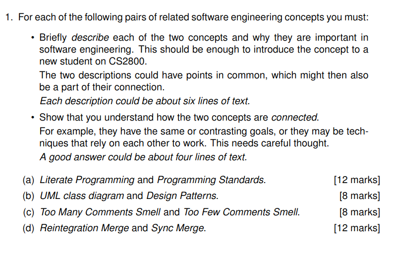
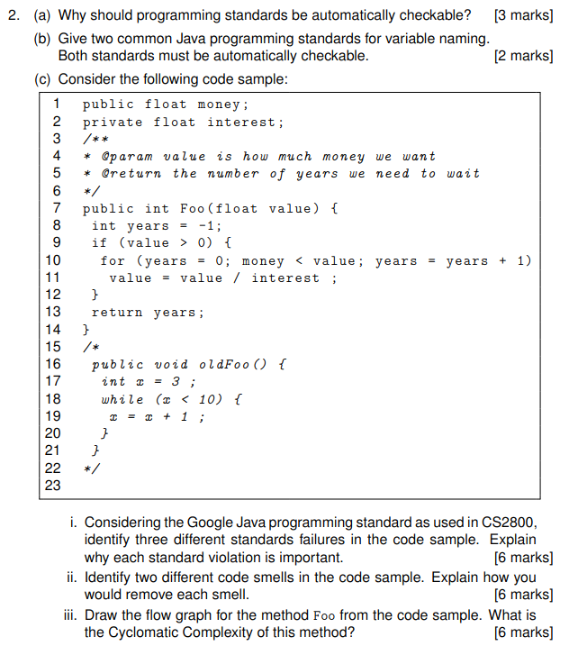
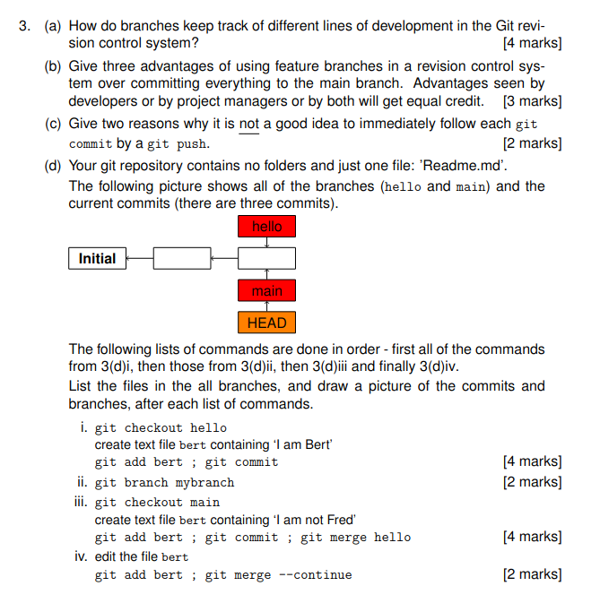
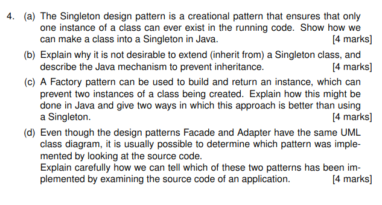

 # SWE 23 Paper
 # 1 



## (a) Literate Programming and Programming Standards [12 marks]

### Literate Programming
Literate Programming is a programming paradigm introduced by Donald Knuth that treats a program as a piece of literature addressed to human readers rather than just instructions for a computer. It emphasizes documentation that is integrated directly with source code, where the programmer explains the logic in natural language alongside the code. This approach makes programs more readable, maintainable, and understandable by prioritizing human comprehension. In a literate program, the narrative explains what the code is doing and why, making it valuable for complex software systems where clarity is essential.

### Programming Standards
Programming Standards are established guidelines, conventions, and best practices that define how code should be written, structured, and documented within an organization or programming community. These standards cover aspects like naming conventions, code formatting, file organization, error handling, and documentation requirements. They create consistency across codebases, making it easier for teams to collaborate, review code, and maintain software over time. Standards help reduce bugs, improve code quality, and facilitate onboarding of new team members by providing clear expectations for code development.

### Connection
Literate Programming and Programming Standards are connected through their shared goal of improving code comprehensibility and maintainability, though they approach this from different angles. While Literate Programming focuses on explaining the logic and purpose behind code through integrated documentation and narrative, Programming Standards provide the structural framework that ensures consistency in how that code is written. Programming Standards often include documentation requirements that support the goals of Literate Programming. Together, they create a comprehensive approach to software development that values both the creative explanation of code logic and the disciplined adherence to consistent coding practices.

## (b) UML Class Diagram and Design Patterns [8 marks]

### UML Class Diagram
UML (Unified Modeling Language) Class Diagrams are visual representations that show the structure of a system by depicting classes, their attributes, methods, and the relationships between classes. They serve as blueprints for object-oriented programming implementations, helping developers understand the architecture of a system before writing code. Class diagrams document a system's classes, interfaces, associations, inheritance, and dependencies, making them crucial for both design communication and system documentation. They're particularly valuable in large projects where understanding the relationships between components is essential for effective development.

### Design Patterns
Design Patterns are established, reusable solutions to common problems in software design. They represent best practices evolved over time by experienced software developers. Patterns like Singleton, Factory, Observer, and MVC provide templates for solving specific design challenges in a way that promotes code reusability, maintainability, and extensibility. Design patterns help developers communicate using well-understood names for software interactions, accelerate the development process by providing tested paradigms, and improve code organization by encouraging separation of concerns.

### Connection
UML Class Diagrams and Design Patterns work synergistically in software engineering. Class diagrams serve as the visual documentation tool that can explicitly represent design patterns in a standardized notation. When implementing design patterns, developers often create class diagrams first to visualize and communicate how the pattern's components will interact. Class diagrams help ensure that the pattern is correctly implemented by showing the relationships, inheritance hierarchies, and interfaces that make up the pattern. Essentially, if design patterns are the architectural recipes for solving common software problems, class diagrams are the architectural blueprints that help engineers implement those solutions correctly.

## (c) Too Many Comments Smell and Too Few Comments Smell [8 marks]

### Too Many Comments Smell
"Too Many Comments Smell" is a code smell indicating that excessive comments might be compensating for unclear code. When code requires extensive commenting to be understood, it often suggests that the code itself could be rewritten to be more self-explanatory. Excessive comments can become a maintenance burden, as they frequently become outdated when code changes but comments remain unrevised. In well-written code, clear naming conventions, proper function decomposition, and adherence to design principles should reduce the need for explanatory comments. This smell reminds developers that comments should clarify why something is done rather than what is being done.

### Too Few Comments Smell
"Too Few Comments Smell" occurs when code lacks necessary documentation to understand complex logic, business rules, or non-obvious implementation decisions. While clean code should be somewhat self-documenting, certain aspects still benefit from clear explanations—particularly business domain logic, complex algorithms, workarounds, or performance optimizations. Without adequate comments, developers may struggle to understand the rationale behind certain implementations, leading to maintenance difficulties, potential bugs during modifications, and time wasted deciphering code. This smell emphasizes that strategic commenting is essential for code maintainability and knowledge transfer.

### Connection
Both comment-related code smells represent opposite ends of a spectrum but point to the same core principle: comments should provide appropriate context without duplicating what the code already says clearly. The connection lies in finding the balanced middle ground where comments add value by explaining the "why" rather than the "what." Both smells suggest that refactoring might be necessary—either to make code clearer so fewer comments are needed, or to add strategic documentation where complex logic exists. Effective developers must navigate between these extremes, using comments judiciously to enhance understanding without creating maintenance overhead, ultimately striving for clean, self-explanatory code supplemented by meaningful documentation.

## (d) Reintegration Merge and Sync Merge [12 marks]

### Reintegration Merge
Reintegration Merge is a version control operation where changes from a long-lived branch (typically a feature branch) are merged back into its parent branch (often the main development branch), marking the completion of feature development. This operation integrates all accumulated changes from the feature branch, including any incremental merges that may have occurred during development. Reintegration merges are significant events in the development workflow as they represent the final incorporation of a completed feature or major change into the mainline codebase. After a successful reintegration merge, the source branch is often retired since its purpose has been fulfilled.

### Sync Merge
Sync Merge (also called forward integration or reverse integration) is a version control operation where changes from a parent branch are merged into a child branch to keep the child branch updated with ongoing developments. This is typically done periodically during feature development to prevent the feature branch from diverging too far from the main codebase. Sync merges reduce the risk of complex merge conflicts that might occur during the final reintegration. They ensure that feature branches incorporate bug fixes, performance improvements, and other enhancements from the main branch, allowing developers to test their features against the latest codebase.

### Connection
Reintegration Merge and Sync Merge represent complementary operations in branch-based version control workflows, forming a bidirectional relationship that maintains codebase coherence during parallel development. Sync merges flow from the parent to child branches (keeping feature work updated with mainline changes), while reintegration merges flow from child to parent (delivering completed features to the mainline). Together, they form a complete merge strategy that minimizes integration problems by preventing branches from diverging too far. The frequency of sync merges directly impacts the complexity of the eventual reintegration merge—more frequent sync merges typically result in smoother reintegration. This relationship is essential in modern development practices like GitFlow or trunk-based development, where multiple developers work simultaneously on different features.


# 2 



# Java Programming Standards Analysis

## 2. (a) Why should programming standards be automatically checkable? [3 marks]

Programming standards should be automatically checkable for three key reasons:

1. **Consistency and Reliability**: Automated checking ensures consistent application of standards across an entire codebase and development team. Manual checking is prone to human error, oversight, and subjective interpretation, while automated tools apply rules uniformly.

2. **Continuous Integration**: Automated standard checking can be integrated into the development workflow and CI/CD pipelines, allowing standards to be verified with each commit or build. This provides immediate feedback to developers rather than discovering violations during later code reviews.

3. **Scalability and Efficiency**: As codebases grow in size and complexity, manual checking becomes impractical and time-consuming. Automated tools can efficiently scan millions of lines of code in minutes, identifying violations that would be difficult to detect manually and freeing developers to focus on more creative aspects of development.

## 2. (b) Give two common Java programming standards for variable naming that are automatically checkable. [2 marks]

1. **Camel Case for Variable Names**: Java variables should use camelCase notation (starting with lowercase letter, with each subsequent word capitalized). This is automatically checkable by verifying that variable names match the pattern `^[a-z][a-zA-Z0-9]*$` and don't contain underscores.

2. **Constant Naming Convention**: Constants (final static variables) should use UPPER_SNAKE_CASE (all uppercase letters with words separated by underscores). This is automatically checkable by verifying that constant names match the pattern `^[A-Z][A-Z0-9]*(_[A-Z0-9]+)*$`.

## 2. (c) Code Sample Analysis

### i. Three Google Java Programming Standard Failures [6 marks]

1. **Non-private Class Fields**: The variable `money` on line 1 is declared as `public float money;`, violating the Google Java Style Guide which recommends that class fields should be private or protected. Public class fields break encapsulation, enabling external classes to modify the state directly without validation. This creates potential for incorrect state and makes future refactoring difficult.

2. **Method Naming Convention**: The method `Foo` on line 7 uses an incorrect naming convention. According to Google Java Style Guide, method names should be in camelCase and typically start with a verb. Using `Foo` as a method name is non-descriptive and violates the standard that method names should clearly indicate their purpose. Proper naming improves code readability and self-documentation.

3. **Commented-out/Dead Code**: Lines 15-22 contain commented-out code (`oldFoo` method). The Google Java Style Guide discourages keeping commented-out code in the codebase. Dead code creates confusion about what functionality is active, increases maintenance burden, and clutters the source files. Unused code should be removed and tracked in version control if needed later.

### ii. Two Code Smells and How to Remove Them [6 marks]

1. **Misleading Variable Names and Comments**: The variable names `money`, `interest`, and `value` along with the incorrect Javadoc (@param and @return) suggest financial calculations, but the method's logic doesn't match this expectation. The Javadoc claims to return "the number of years we need to wait" but the computation doesn't reflect a proper financial model.

   **Removal**: Rename variables and method to accurately reflect what they do. If this is indeed a financial calculation, correct the algorithm. Properly document the method with accurate Javadoc comments:
   ```java
   /**
    * Calculates the number of years required for an investment to reach a target value.
    * @param targetValue the target value to reach
    * @return the number of years required, or -1 if the target is not achievable
    */
   public int calculateYearsToReachTarget(float targetValue) {
       // Then fix the calculation logic as needed
   }
   ```

2. **Magic Numbers**: The code uses magic numbers like `-1` (line 8) without explanation of what this return value signifies. Magic numbers make code harder to understand and maintain.

   **Removal**: Replace magic numbers with named constants that explain their purpose:
   ```java
   private static final int TARGET_UNREACHABLE = -1;
   
   public int calculateYearsToReachTarget(float targetValue) {
       int years = TARGET_UNREACHABLE;
       // Rest of method
   }
   ```

### iii. Flow Graph and Cyclomatic Complexity for Foo Method [6 marks]

**Flow Graph for Foo method:**

```
             (Start)
               |
               V
          (years = -1)
               |
               V
         (value > 0)?
           /     \
          /       \
         No       Yes
         |         |
         |         V
         |    (years = 0)
         |         |
         |         V
         |    (money < value)?
         |       /     \
         |      /       \
         |     Yes      No
         |     |         |
         |     V         |
         |  (value = value/interest)
         |     |         |
         |     V         |
         |  (years = years + 1)
         |     |         |
         |     |_________|
         |         |
         |         V
         |      (Loop)
         |         |
         \         /
          \       /
           \     /
            \   /
             V V
         (return years)
              |
              V
            (End)
```

**Cyclomatic Complexity Calculation:**

For the method `Foo`, the cyclomatic complexity can be calculated using the formula:
`V(G) = E - N + 2P`
where:
- E is the number of edges in the flow graph
- N is the number of nodes in the flow graph
- P is the number of connected components (typically 1 for a single method)

In this flow graph:
- Edges (E) = 10
- Nodes (N) = 9
- Connected Components (P) = 1

Therefore:
`V(G) = 10 - 9 + 2(1) = 3`

The cyclomatic complexity of the method `Foo` is 3, which indicates there are 3 independent paths through the code:
1. value ≤ 0 path
2. value > 0 but money ≥ value initially (loop not entered)
3. value > 0 and money < value (loop entered at least once)

This represents relatively low complexity, which is generally considered good for maintainability and testability.

# 3 



# Git Branching and Revision Control

## 3. (a) How branches keep track of different lines of development in Git [4 marks]

In Git, branches keep track of different lines of development through a few key mechanisms:

1. **Commit References**: A branch in Git is essentially a lightweight movable pointer to a specific commit. Each branch maintains a reference to the latest commit in that particular line of development.

2. **Commit History Chain**: Every commit in Git stores a reference to its parent commit(s), creating a chain of history. When a branch is created, it shares history with its parent branch up to the point of creation but then diverges as new commits are added.

3. **HEAD Pointer**: Git uses a special pointer called HEAD to track the current active branch. When commits are made, they're added to the branch that HEAD points to, and the branch reference moves forward automatically.

4. **Tree Objects**: Git's internal data structure stores the state of files at each commit through tree objects, allowing different branches to maintain completely separate versions of the same files without conflict until merge time.

## 3. (b) Three advantages of using feature branches over committing to main branch [3 marks]

1. **Isolation of Work**: Feature branches allow developers to work on new features or bug fixes in isolation from the main codebase. This prevents incomplete or potentially buggy code from affecting other developers or disrupting the stability of the main branch, which is particularly valuable in collaborative environments.

2. **Parallel Development**: Multiple features can be developed simultaneously by different team members without interference. Each developer can work at their own pace on separate branches, enabling more efficient workflow management and reducing bottlenecks that would occur if everyone had to coordinate commits to a single branch.

3. **Code Review and Quality Control**: Feature branches facilitate a structured code review process before code is merged into the main branch. Project managers can implement policies where changes must be reviewed and approved through pull/merge requests, ensuring that only high-quality, tested code reaches the production codebase.

## 3. (c) Two reasons not to immediately follow git commit with git push [2 marks]

1. **Local Testing and Verification**: Immediately pushing commits prevents the opportunity to test changes in the local environment first. Keeping commits local allows developers to run tests, verify functionality, and ensure code quality before making changes visible to the entire team, potentially avoiding the propagation of bugs to other team members.

2. **Commit Organization and Cleanup**: Not pushing immediately gives developers the chance to organize, squash, or amend their commits for clarity and coherence. This includes fixing commit messages, combining minor changes into logical units, or even reverting local mistakes without leaving a confusing trail of fixes in the shared repository history.

## 3. (d) Git repository commands and resulting state

### i. `git checkout hello`, create file bert with "I am Bert", `git add bert ; git commit` [4 marks]

After these commands:

**Files in branches:**
- **hello branch**: README.md, bert ("I am Bert")
- **main branch**: README.md (unchanged)

**Commit and branch diagram:**
```
Initial --- [Commit 1] --- [Commit 2] --- [Commit 3: Add bert file]
                              |             |
                            main          hello
                              |             |
                            HEAD          HEAD (current)
```

### ii. `git branch mybranch` [2 marks]

After this command:

**Files in branches:**
- **hello branch**: README.md, bert ("I am Bert") (current branch)
- **main branch**: README.md
- **mybranch branch**: README.md, bert ("I am Bert") (same as hello at this point)

**Commit and branch diagram:**
```
Initial --- [Commit 1] --- [Commit 2] --- [Commit 3: Add bert file]
                              |             |
                            main          hello (current)
                                           |
                                        mybranch
```

### iii. `git checkout main`, create file bert with "I am not Fred", `git add bert ; git commit ; git merge hello` [4 marks]

After these commands:

**Files in branches:**
- **hello branch**: README.md, bert ("I am Bert")
- **main branch**: README.md, bert ("I am not Fred") (current branch, after merge conflict resolution)
- **mybranch branch**: README.md, bert ("I am Bert")

**Commit and branch diagram:**
```
Initial --- [Commit 1] --- [Commit 2] --- [Commit 4: Add bert "I am not Fred"] --- [Commit 5: Merge hello]
                              |             |                                          |
                              |             |                                        main (current)
                              |             |                                          |
                              |          [Commit 3: Add bert "I am Bert"]            HEAD
                              |             |
                              |           hello
                              |             |
                              |         mybranch
```

Note: The merge likely created a conflict since both branches modified the same file "bert" with different content. The resolution kept "I am not Fred" as shown in the next step.

### iv. edit the file bert, `git add bert ; git merge --continue` [2 marks]

After these commands:

**Files in branches:**
- **hello branch**: README.md, bert ("I am Bert")
- **main branch**: README.md, bert (edited content after merge conflict resolution) (current branch)
- **mybranch branch**: README.md, bert ("I am Bert")

**Commit and branch diagram:**
```
Initial --- [Commit 1] --- [Commit 2] --- [Commit 4: Add bert "I am not Fred"] --- [Commit 5: Merge hello with resolved conflict]
                              |             |                                          |
                              |             |                                        main (current)
                              |             |                                          |
                              |          [Commit 3: Add bert "I am Bert"]            HEAD
                              |             |
                              |           hello
                              |             |
                              |         mybranch
```

The final result shows the repository with three branches: main (current), hello, and mybranch. The main branch contains the resolved version of the bert file after addressing the merge conflict.


# 4 




## 4. (a) How to Implement Singleton in Java [4 marks]

A Singleton design pattern can be implemented in Java using several approaches. Here's a common and effective implementation:

```java
public class Singleton {
    // Private static instance variable
    private static volatile Singleton instance;
    
    // Private constructor prevents instantiation from other classes
    private Singleton() {
        // Prevent reflection-based instantiation
        if (instance != null) {
            throw new IllegalStateException("Singleton already initialized");
        }
    }
    
    // Public static method for getting the instance
    public static Singleton getInstance() {
        // Double-checked locking for thread safety
        if (instance == null) {
            synchronized (Singleton.class) {
                if (instance == null) {
                    instance = new Singleton();
                }
            }
        }
        return instance;
    }
}
```

This implementation ensures that only one instance of the class exists by:
1. Making the constructor private to prevent direct instantiation
2. Providing a static getInstance() method as the single access point
3. Using double-checked locking for thread safety
4. Including protection against reflection-based instantiation attempts

## 4. (b) Why Singleton Inheritance is Undesirable and Prevention Mechanisms [4 marks]

Extending a Singleton class is undesirable for several reasons:
1. The child class could create multiple instances, violating the Singleton guarantee of the parent class
2. The child class may override methods that the Singleton relies on for its uniqueness
3. It creates confusion about which instance (parent or child) should be the "one true instance"
4. Inheritance generally exposes implementation details, which goes against encapsulation principles

Java provides several mechanisms to prevent inheritance of a Singleton class:

1. **Making the class final:**
```java
public final class Singleton {
    // Singleton implementation
}
```
The `final` keyword prevents any class from extending the Singleton, which is the most straightforward and recommended approach.

2. **Using a private constructor with static methods:**
   A private constructor already prevents direct instantiation. When combined with static methods for functionality, this approach effectively prevents meaningful inheritance since constructors cannot be inherited and are required to create subclass instances.

## 4. (c) Using Factory Pattern to Prevent Multiple Instances [4 marks]

A Factory pattern can be used to build and return an instance while preventing multiple instances of a class. Here's how this can be implemented in Java:

```java
public class RestrictedInstanceFactory {
    // Keep track of created instances
    private static final Map<String, Object> instances = new HashMap<>();
    
    // Private constructor prevents direct instantiation
    private RestrictedInstanceFactory() {}
    
    // Factory method that ensures only one instance exists
    public static <T> T createInstance(Class<T> clazz) throws Exception {
        String key = clazz.getName();
        
        // If an instance already exists, return it
        if (instances.containsKey(key)) {
            return clazz.cast(instances.get(key));
        }
        
        // Otherwise, create a new instance
        T instance = clazz.getDeclaredConstructor().newInstance();
        instances.put(key, instance);
        return instance;
    }
}
```

This approach is better than using a Singleton in two key ways:

1. **Greater Flexibility**: The Factory pattern can control instance creation for multiple classes, not just a single class as with Singleton. This makes it more versatile for systems where multiple classes need controlled instantiation.

2. **Better Testability**: Code using the Factory pattern is generally easier to test because you can replace the factory with a mock factory during testing. Singletons, being globally accessible with static state, make unit testing more difficult as they can't be easily mocked or replaced with test doubles.

## 4. (d) Distinguishing Between Facade and Adapter Patterns in Source Code [4 marks]

Although Facade and Adapter patterns may have similar UML class diagrams, examining the source code reveals distinct differences in their implementation and purpose:

### Key Differences to Look For:

1. **Method Names and Parameters:**
    - **Facade**: Method names in a Facade typically represent higher-level operations that combine multiple subsystem operations. They often use business domain terminology.
    - **Adapter**: Method names in an Adapter typically match the interface being adapted to, with parameters that are translated from one form to another.

2. **Internal Implementation:**
    - **Facade**: Contains calls to multiple different classes from a subsystem, orchestrating their functionality to provide a simplified interface.
    - **Adapter**: Contains calls primarily to a single "adaptee" class, translating between incompatible interfaces.

3. **Class Relationships:**
    - **Facade**: Will typically have dependencies on multiple subsystem classes, often instantiating them directly.
    - **Adapter**: Will have a dependency on a single adaptee class (or interface) that it's adapting, often passed in as a constructor parameter or set via a method.

4. **Implementation Purpose:**
    - **Facade**: Code comments or class documentation will mention "simplification," "unified interface," or "hiding complexity."
    - **Adapter**: Code comments will mention "compatibility," "conversion," or "making X work with Y."

### Example Comparison:

```java
// This is likely a Facade
public class OrderProcessingFacade {
    private InventoryService inventory;
    private PaymentProcessor payment;
    private ShippingService shipping;
    private NotificationService notification;
    
    public void processOrder(Order order) {
        // Orchestrates multiple subsystems
        if (inventory.checkAvailability(order.getItems())) {
            payment.processPayment(order.getPaymentDetails());
            shipping.scheduleDelivery(order);
            notification.sendConfirmation(order.getCustomerEmail());
        }
    }
}

// This is likely an Adapter
public class LegacyPrinterAdapter implements ModernPrinter {
    private LegacyPrinter legacyPrinter; // Single adaptee
    
    public LegacyPrinterAdapter(LegacyPrinter printer) {
        this.legacyPrinter = printer;
    }
    
    @Override
    public void print(Document document) {
        // Translates between interfaces
        legacyPrinter.printDocument(
            document.getContent(), 
            document.getFormat().toLegacyFormat()
        );
    }
}
```

By examining these aspects of the source code, we can reliably distinguish between a Facade pattern (which simplifies a complex subsystem) and an Adapter pattern (which makes incompatible interfaces work together).