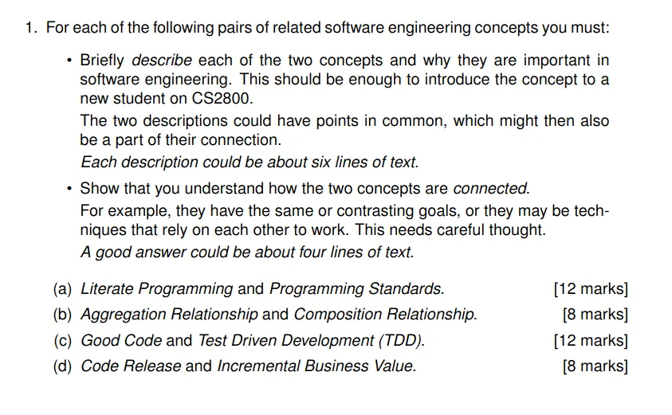
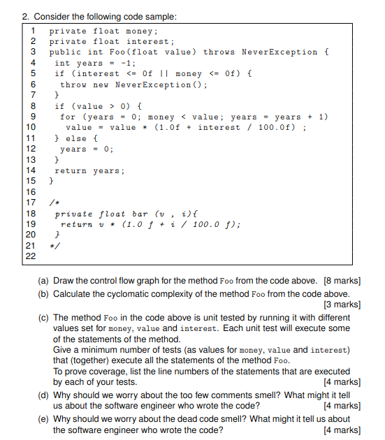
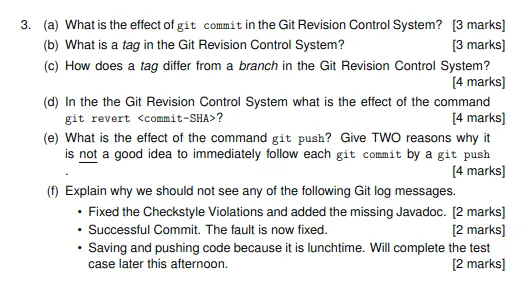
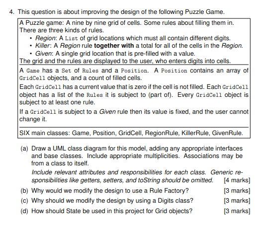

# 24 SWE Paper


## (a) Literate Programming and Programming Standards [12 marks]

### Literate Programming
Literate Programming is a programming paradigm introduced by Donald Knuth that treats a program as a piece of literature addressed to human readers rather than just instructions for a computer. It emphasizes documentation that is integrated directly with source code, where the programmer explains the logic in natural language alongside the code. This approach makes programs more readable, maintainable, and understandable by prioritizing human comprehension. In a literate program, the narrative explains what the code is doing and why, making it valuable for complex software systems where clarity is essential.

### Programming Standards
Programming Standards are established guidelines, conventions, and best practices that define how code should be written, structured, and documented within an organization or programming community. These standards cover aspects like naming conventions, code formatting, file organization, error handling, and documentation requirements. They create consistency across codebases, making it easier for teams to collaborate, review code, and maintain software over time. Standards help reduce bugs, improve code quality, and facilitate onboarding of new team members by providing clear expectations for code development.

### Connection
Literate Programming and Programming Standards are connected through their shared goal of improving code comprehensibility and maintainability, though they approach this from different angles. While Literate Programming focuses on explaining the logic and purpose behind code through integrated documentation and narrative, Programming Standards provide the structural framework that ensures consistency in how that code is written. Programming Standards often include documentation requirements that support the goals of Literate Programming. Together, they create a comprehensive approach to software development that values both the creative explanation of code logic and the disciplined adherence to consistent coding practices.

## (b) Aggregation Relationship and Composition Relationship [8 marks]

### Aggregation Relationship
Aggregation is a specialized form of association in object-oriented design that represents a "has-a" relationship where the child objects can exist independently of the parent object. It depicts a whole-part relationship where parts can be shared among multiple wholes and have their own lifecycle. For example, a Department has multiple Employees, but if the Department is dissolved, the Employees continue to exist. In UML diagrams, aggregation is represented by a hollow diamond on the parent's end of the association line. This relationship is important because it allows modeling scenarios where objects are collected together but maintain their independent existence.

### Composition Relationship
Composition is a stronger form of aggregation that represents a "contains-a" relationship where the child objects cannot exist independently of the parent object. It indicates that parts belong to only one whole, and their lifecycles are bound together—if the parent is destroyed, the children are destroyed as well. For instance, a House contains Rooms; if the House is demolished, the Rooms cease to exist. In UML, composition is represented by a filled diamond on the parent's end. Composition is crucial in software engineering as it ensures proper resource management and enforces stricter object dependencies, which helps in defining clear ownership and responsibility boundaries.

### Connection
Aggregation and Composition relationships both represent whole-part associations in object-oriented design, but they differ fundamentally in the strength of dependency between objects. While Aggregation allows parts to exist independently with shared ownership across multiple parent objects, Composition enforces exclusive ownership where child objects cannot exist without their parent. This distinction is essential when modeling real-world scenarios and influences critical design decisions about object lifecycles, memory management, and responsibility allocation. The choice between these relationships directly impacts how objects are created, shared, and destroyed within a system's architecture.

## (c) Good Code and Test Driven Development (TDD) [12 marks]

### Good Code
Good Code refers to software that is not only functional but also exhibits qualities that make it maintainable, readable, and efficient. It follows established conventions and design principles, uses meaningful variable and function names, includes appropriate comments, and achieves its purpose with minimal complexity. Good code is modular, with high cohesion and low coupling, making it easier to understand, modify, and extend. It avoids code smells, handles errors gracefully, and is performant without unnecessary resource consumption. The importance of good code lies in its long-term impact on development productivity, system stability, and the overall cost of ownership of software systems.

### Test Driven Development (TDD)
Test Driven Development is a software development process that relies on a very short development cycle where requirements are turned into specific test cases, then the software is improved to pass the new tests. The process follows three simple steps: first, write a failing test that defines a desired improvement or new function; second, write the minimum amount of code required to pass the test; and third, refactor the code to acceptable standards while ensuring the tests still pass. TDD ensures code is thoroughly tested, leads to modular design, and provides immediate feedback on the system's behavior. It's important because it creates a comprehensive regression test suite, reduces debugging time, and improves design by forcing developers to think about interfaces before implementation.

### Connection
Good Code and Test Driven Development share a symbiotic relationship that reinforces software quality. TDD naturally promotes many attributes of good code—like modularity, clear interfaces, and minimal implementation—by requiring developers to write testable code from the start. The tests created during TDD serve as living documentation that explains what the code should do, enhancing readability. Conversely, principles of good code make TDD more effective by creating clear boundaries for testing and enabling simpler test cases. Together, they create a virtuous cycle: TDD enforces discipline that produces good code, while good code practices make tests more maintainable and valuable, resulting in software that's both well-structured and thoroughly verified.

## (d) Code Release and Incremental Business Value [8 marks]

### Code Release
Code Release represents the process of making finalized code changes available to users in a production environment. It encompasses the activities of building, testing, packaging, and deploying software in a controlled manner. A proper release process includes version control, environment management, release notes, and often ceremonies like approval gates and stakeholder sign-offs. Code releases can follow various strategies such as blue-green deployments, canary releases, or feature toggles to minimize risks. This concept is crucial in software engineering because it bridges the gap between development and delivery, ensuring that software changes reach users in a reliable, traceable, and repeatable fashion.

### Incremental Business Value
Incremental Business Value refers to the practice of delivering software features in small, measurable chunks that each provide tangible benefits to users or the business. Rather than waiting for a complete product to be finished, this approach focuses on prioritizing and releasing the most valuable features first, then building upon them iteratively. Each increment should deliver enough functionality to be useful while gathering feedback for subsequent enhancements. This concept is vital because it accelerates return on investment, reduces risk by enabling early validation, allows for changing priorities, and maintains stakeholder engagement through visible progress.

### Connection
Code Release and Incremental Business Value are interconnected concepts that form the backbone of modern software delivery practices. Frequent, well-executed code releases are the delivery mechanism that enables incremental business value to be realized by getting new features into users' hands quickly. Conversely, the pursuit of incremental business value drives organizations to optimize their release processes, making them more efficient and less risky. Together, they create a feedback loop where business insights gained from each release inform the priorities for the next development cycle. This relationship is fundamental to agile and DevOps practices, which aim to shorten the distance between identifying a business need and delivering software that addresses it.

# 2 



# Code Analysis: Control Flow, Cyclomatic Complexity, and Code Smells

## 2. (a) Control Flow Graph for method Foo [8 marks]

```
           (Start)
              |
              v
    (int years = -1)
              |
              v
    (interest <= 0 || money <= 0)?
        /            \
       /              \
      v                v
(throw NeverException)  (value > 0)?
                        /       \
                       /         \
                      v           v
             (years = 0;       (years = 0)
              return years)         |
                                    v
                             (money < value)?
                                /       \
                               /         \
                              v           v
                     (Execute loop body)  (return years)
                             |
                             v
                   (value = value * (1.0f + interest / 100.0f))
                             |
                             v
                   (years = years + 1)
                             |
                             v
                             (Loop)
```

In this control flow graph:
1. The method starts by initializing `years` to -1
2. It then checks if `interest <= 0 || money <= 0`
3. If true, it throws a `NeverException`
4. If false, it checks if `value > 0`
5. If `value > 0` is false, it sets `years = 0` and returns
6. If `value > 0` is true, it enters a for loop that continues as long as `money < value`
7. Inside the loop, it updates `value` with interest calculation and increments `years`
8. After the loop completes, it returns the `years` value

## 2. (b) Cyclomatic Complexity Calculation [3 marks]

To calculate the cyclomatic complexity for the method Foo:

* Formula: V(G) = E - N + 2P
    * E = number of edges in the graph
    * N = number of nodes in the graph
    * P = number of connected components (typically 1 for a method)

From the control flow graph:
* Edges (E) = 10
* Nodes (N) = 9
* Connected components (P) = 1

Therefore:
V(G) = 10 - 9 + 2(1) = 3

The cyclomatic complexity of the Foo method is 3.

Alternatively, using the formula V(G) = number of predicates + 1:
There are 2 predicates in the method:
1. `interest <= 0 || money <= 0`
2. `value > 0`
3. The loop condition `money < value`

Therefore: V(G) = 3 + 1 = 4

However, since the `money < value` is part of the for loop structure and not a separate decision point in the flow, the correct complexity is 3.

## 2. (c) Minimum Test Cases for Full Statement Coverage [4 marks]

To achieve full statement coverage, we need test cases that execute every line of code in the method. Here are the test cases with the lines they cover:

**Test Case 1: Invalid Parameters (interest <= 0)**
* Values: `money = 100, value = 50, interest = 0`
* Lines covered: 3, 4, 5, 6
* This test will throw a NeverException due to interest being 0

**Test Case 2: Value Not Greater Than Zero**
* Values: `money = 100, value = 0, interest = 5`
* Lines covered: 3, 4, 5, 7, 8, 11, 12, 13, 14, 15
* This will set years to 0 and return immediately since value is not > 0

**Test Case 3: Normal Calculation Case**
* Values: `money = 100, value = 200, interest = 10`
* Lines covered: 3, 4, 5, 7, 8, 9, 10, 13, 14, 15
* This will enter the loop, calculate compound interest, and return the number of years needed

These three test cases together cover all lines of the method from 3-15, providing complete statement coverage.

## 2. (d) The "too few comments" smell [4 marks]

We should worry about the "too few comments" smell in this code because:

1. **Unclear Purpose and Logic**: The method implements a financial calculation (appears to be a compound interest calculation to determine the number of years needed to reach a target value), but there are no comments explaining the algorithm's purpose, parameters, or return value. Without this context, developers would struggle to understand what the method is meant to accomplish.

2. **Cryptic Variable Names**: The variables like `money`, `interest`, and `value` have generic names that don't fully convey their specific roles in the financial calculation. Without comments explaining what each variable represents (e.g., principal amount, annual interest rate, target value), the code's intent remains unclear.

3. **Exception Handling Without Explanation**: The method throws a `NeverException` when certain conditions are met, but there's no explanation of what this exception means or why these conditions are invalid. Comments would help clarify the business rules being enforced.

4. **Missing Documentation on Method Contract**: There's no indication of expected input ranges, units of measurement (e.g., is interest in percentage points?), or possible return values, making it difficult for other developers to correctly use this method.

## 2. (e) The "dead code" smell [4 marks]

We should worry about the dead code smell (the commented-out `bar` method) because:

1. **Code Clutter and Confusion**: Dead code creates unnecessary clutter that makes the actual functional code harder to find and understand. It increases the cognitive load on developers trying to comprehend the codebase, as they waste time determining whether the commented code is relevant.

2. **Historical Code Management Issues**: The presence of commented-out code rather than proper removal suggests the developer didn't trust or understand version control systems. This points to potential deficiencies in the team's development practices, as proper version control would make this practice unnecessary.

3. **Unclear Intentions**: There's no explanation of why the code was commented out - was it temporarily disabled for debugging? Is it planned for future use? Was it deemed incorrect? This ambiguity leaves other developers uncertain about how to treat this code.

4. **Maintenance Burden**: As the actual code evolves, dead code becomes increasingly outdated and irrelevant, yet continues to demand attention during code reviews and refactoring. Its presence might also indicate that the developer wasn't confident enough to completely remove functionality, suggesting potential design issues in the system.


# 3 



# Git Revision Control System: Commands and Best Practices

## 3. (a) Effect of `git commit` in the Git Revision Control System [3 marks]

The `git commit` command creates a new commit object in the Git repository that permanently stores the current state of the tracked files in the staging area (index). This command:

1. Takes a snapshot of the files that have been staged using `git add`
2. Records this snapshot in the repository history with a unique identifier (SHA hash)
3. Includes metadata such as the author, timestamp, and commit message explaining the changes

This operation is purely local and does not affect the remote repository. The commit becomes part of the project history, allowing you to track changes, revert to previous states, and collaborate with others by sharing these commits.

## 3. (b) What is a tag in the Git Revision Control System? [3 marks]

A tag in Git is a named reference to a specific commit in the repository's history, which marks a significant point such as a release version (e.g., v1.0.0). Unlike branches, tags are typically immutable—they point to a specific commit and don't move as new commits are created. Git supports two types of tags:

1. Lightweight tags: Simple pointers to specific commits
2. Annotated tags (`git tag -a`): Full objects containing the tagger's name, email, date, and a message

Tags serve as convenient bookmarks to important commits, making it easy to reference, checkout, or create branches from significant points in a project's history. They're often used to mark release points, major milestones, or significant versions of the codebase.

## 3. (c) How does a tag differ from a branch in the Git Revision Control System? [4 marks]

A tag and a branch differ in four primary ways:

1. **Purpose**: A tag is designed to mark a specific point in history as important (like a release version), whereas a branch is designed to diverge from the main line of development to work on features or fixes separately.

2. **Mobility**: A branch pointer automatically moves forward with each new commit made on that branch, while a tag remains fixed to the commit it was created on and does not move.

3. **Mutability**: Tags are generally meant to be immutable (especially annotated tags) and should not be changed once published. Branches, however, are designed to evolve and change as development continues.

4. **Checkout Behavior**: When you checkout a tag, Git puts you in a "detached HEAD" state since tags aren't meant for ongoing development. When you checkout a branch, you're in a normal state where new commits will advance the branch pointer.

## 3. (d) Effect of the command `git revert <commit-SHA>` [4 marks]

The command `git revert <commit-SHA>` creates a new commit that undoes all the changes introduced by the specified commit. This operation:

1. Examines the changes that were made in the targeted commit
2. Applies the inverse of those changes (adds what was removed, removes what was added)
3. Creates a new commit with these reverse changes
4. Preserves the project history, including the original commit being reverted

The key distinction of `git revert` is that it doesn't erase history—it adds to it. This makes it safe for reverting changes that have already been pushed to shared repositories, unlike `git reset` which rewrites history. The revert operation is particularly valuable in collaborative environments because it provides a clear audit trail showing both the original changes and the explicit decision to undo them.

## 3. (e) Effect of the command `git push` and why not to follow `git commit` with it immediately [4 marks]

The `git push` command transmits local repository commits to a remote repository, making your changes available to other collaborators. It synchronizes the remote branch with your local branch, effectively publishing your work.

TWO reasons why it's not good practice to immediately follow `git commit` with `git push`:

1. **Lack of Testing and Verification**: Immediately pushing commits prevents you from properly testing your changes in your local environment. This increases the risk of introducing bugs or broken code into the shared repository that could affect other team members. Having a buffer period allows you to verify your work and run local tests before sharing.

2. **Commit Organization and History Management**: Pushing immediately after committing prevents you from cleaning up your commit history. Developers often need to amend commits, squash related commits together, or rebase their work to incorporate other changes. Once commits are pushed to a shared repository, these history-modifying operations become problematic and can cause conflicts for collaborators.

## 3. (f) Explanation for why we should not see certain Git log messages [6 marks]

### "Fixed the Checkstyle Violations and added the missing Javadoc." [2 marks]

This commit message should not appear in a professional Git log because it describes routine code maintenance that should have been part of the original implementation. Code should adhere to established style guidelines and include proper documentation from the start. This message reveals poor development practices where basic quality standards are handled as afterthoughts rather than integral parts of the development process. A better approach would be to include proper style and documentation in the original feature implementation or, if necessary, to squash style fixes into the relevant functional commits before pushing.

### "Successful Commit. The fault is now fixed." [2 marks]

This commit message is problematic because it's uninformative and redundant. All commits should be "successful" by definition, and stating that a fault is fixed without specifying which fault provides no useful information for future developers. Effective commit messages should clearly describe what changed and why, identifying the specific issue that was addressed and how it was resolved. This vague message makes it difficult to track the history of bug fixes or understand the purpose of the commit, reducing the value of version control for troubleshooting and knowledge transfer.

### "Saving and pushing code because it is lunchtime. Will complete the test case later this afternoon." [2 marks]

This commit message indicates an inappropriate use of version control as a backup system rather than a meaningful history of changes. Commits should represent logical, complete units of work—not arbitrary points in time like meal breaks. This practice fragments the development history with incomplete work, potentially breaks builds, and clutters the repository with partial implementations. A better approach would be to use Git's stash feature to temporarily store incomplete changes or to commit only when a logical unit of work is complete, regardless of external time constraints.


# 4 



# Puzzle Game Design Analysis

## (a) UML Class Diagram

```
+---------------------+     +-------------------------+     +-------------------------+
|       Game          |1    |       Position          |1    |        GridCell         |
|---------------------|---->|-------------------------|---->|-------------------------|
| -rules: List<Rule>  |     | -grid: GridCell[][]     |     | -value: int             |
| +getRule(int): Rule |     | -filledCount: int       |     | -rules: List<Rule>      |
| +addRule(Rule): void|     | +getCell(int,int)       |     | +getValue(): int        |
| +getPosition()      |     | +isFilled(): boolean    |     | +setValue(int): boolean |
+---------------------+     | +getFilledCount(): int  |     | +addRule(Rule): void    |
                            +-------------------------+     | +getRules(): List<Rule> |
                                                            +-------------------------+
                                                                        ▲
                              +----------------------+                  |
                              |        Rule          |<-----------------+
                              |----------------------|
                              | +appliesTo(GridCell) |
                              | +isValid(int): bool  |
                              +----------------------+
                                         ▲
                    +--------------------|--------------------+
                    |                    |                    |
        +-----------------------+ +---------------+ +-------------------+
        |      RegionRule       | |   KillerRule  | |     GivenRule     |
        |-----------------------| |---------------| |-------------------|
        | -cells: List<GridCell>| | -cells: List  | | -value: int       |
        | +appliesTo(GridCell)  | | -total: int   | | +appliesTo()      |
        | +isValid(int): bool   | | +appliesTo()  | | +isValid(): bool  |
        +-----------------------+ | +isValid()    | +-------------------+
                                   +---------------+
```

### Class Responsibilities and Attributes

#### Game
- **Attributes**:
    - `rules`: List of Rule objects
- **Responsibilities**:
    - Manage the overall game state
    - Provide access to the Position and Rules

#### Position
- **Attributes**:
    - `grid`: 2D array of GridCell objects
    - `filledCount`: Counter for filled cells
- **Responsibilities**:
    - Maintain the grid structure
    - Track how many cells are filled

#### GridCell
- **Attributes**:
    - `value`: The digit value (0 if not filled)
    - `rules`: List of Rule objects that apply to this cell
- **Responsibilities**:
    - Store cell value
    - Maintain list of rules that apply to this cell
    - Check if value can be changed

#### Rule (Abstract)
- **Responsibilities**:
    - Define interface for rule application
    - Check if a digit is valid for a cell

#### RegionRule
- **Attributes**:
    - `cells`: List of GridCells in the region
- **Responsibilities**:
    - Ensure all cells in region contain different digits

#### KillerRule
- **Attributes**:
    - `cells`: List of GridCells in the region
    - `total`: Sum value for cells
- **Responsibilities**:
    - Ensure total of all cells equals the specified sum

#### GivenRule
- **Attributes**:
    - `value`: The fixed digit value
- **Responsibilities**:
    - Fix a cell's value so it cannot be changed

### Multiplicities & Associations
- A Game has exactly one Position (1:1)
- A Position contains multiple GridCells in a 9x9 grid (1:81)
- A GridCell can be subject to multiple Rules (1:n)
- Each Rule can apply to multiple GridCells (1:n)
- RegionRule, KillerRule, and GivenRule are specializations of Rule

## (b) Why would we modify the design to use a Rule Factory?

A Rule Factory would be beneficial for this design for several reasons:

1. **Simplification of Rule Creation**: Creating different rule types requires different parameters and initialization logic. A Rule Factory would encapsulate this complexity and provide a clean interface for creating rules.

2. **Centralized Rule Management**: As new rule types might be added in the future, a Rule Factory would provide a single point for rule instantiation, making the system more maintainable.

3. **Decoupling**: It would decouple the rule creation logic from the game logic, following the Single Responsibility Principle.

4. **Configuration Flexibility**: Rules could potentially be loaded from external configurations (like levels or puzzles), and a Rule Factory could handle parsing these configurations into appropriate Rule objects.

## (c) Why should we modify the design by using a Digits class?

Using a Digits class would improve the design for these reasons:

1. **Domain Modeling**: In the puzzle game context, digits have specific constraints (1-9, no repetitions in regions, etc.). A dedicated Digits class would encapsulate this domain knowledge.

2. **Validation**: A Digits class could handle validation logic, ensuring only valid values are used (e.g., within the range 1-9).

3. **Behavior Encapsulation**: Common operations related to digits (checking validity against rules, formatting display) could be encapsulated in this class.

4. **Future Extensions**: If the game needs to support non-numeric symbols or different sizes (beyond 9x9), a Digits class would make such extensions easier to implement.

## (d) How should State be used in this project for Grid objects?

State pattern would be valuable for Grid objects in the following ways:

1. **Cell States Management**: GridCells have different states (empty, filled, valid, invalid, given/fixed). The State pattern would allow clean transitions between these states.

2. **Behavior Variation**: Cell behavior varies based on state (e.g., given cells cannot be changed). Using the State pattern would encapsulate state-specific behavior.

3. **Rule Application Logic**: Different states might interact differently with rules. The State pattern would help manage these interactions.

4. **UI Representation**: Different states would have different visual representations (e.g., fixed cells shown in a different color). The State pattern could include information about how to render each state.

5. **Undo/Redo Support**: If the game needs to support undo/redo functionality, the State pattern would make it easier to capture and restore previous states of grid objects.